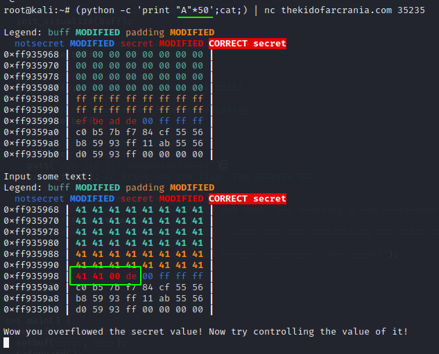
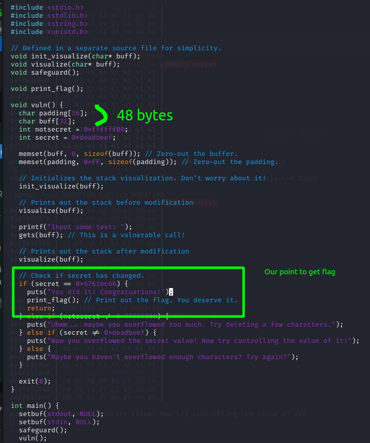
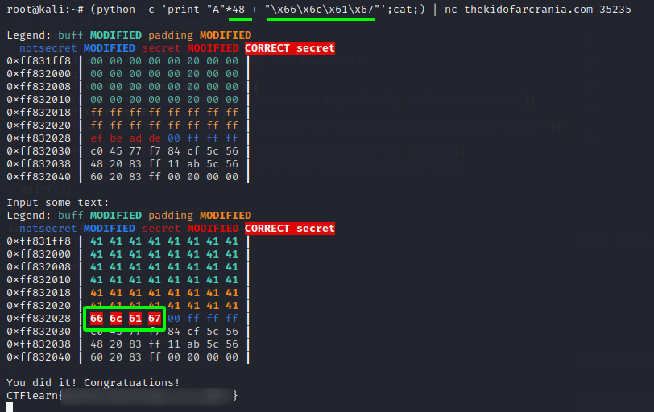

Just overflow it with `A * 100` to see the picture:

Next i overflow it with `A * 50`:

Now time to look at the source code:

As we can see i input the 50 bytes when the source code tell us that padding with A must be 48 bytes.

