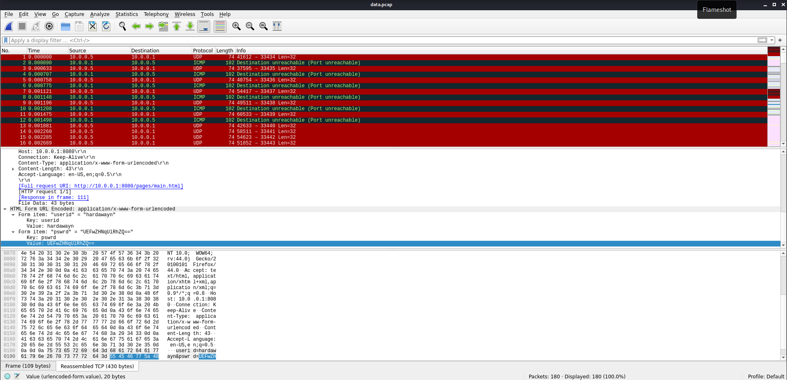
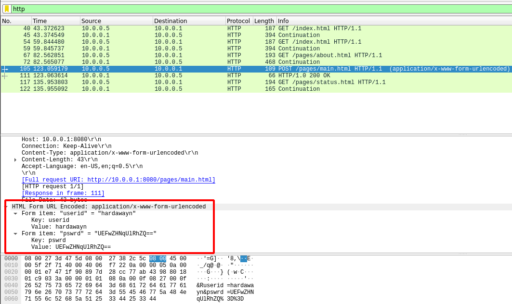

Open data.pcap in `wireshark`:

Then i decided to look at data from application to network layer:

And i saw in there js function ass() that users would probably login through. In one of the packages i found the creds:

You can see that it is the base64 encoded password.
