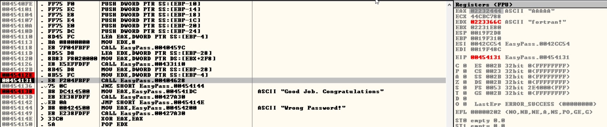

# Find The Easy Pass

Completed: Yes
Date: Jun 15, 2021 → Jun 15, 2021
Platform: HackTheBox

Firstly, I got confused and couldn't find where the program executes its main stuff. 

But after some time, I found it:

Here, you can see that in EAX register moved our input, and in EDX register moved the flag or password.
