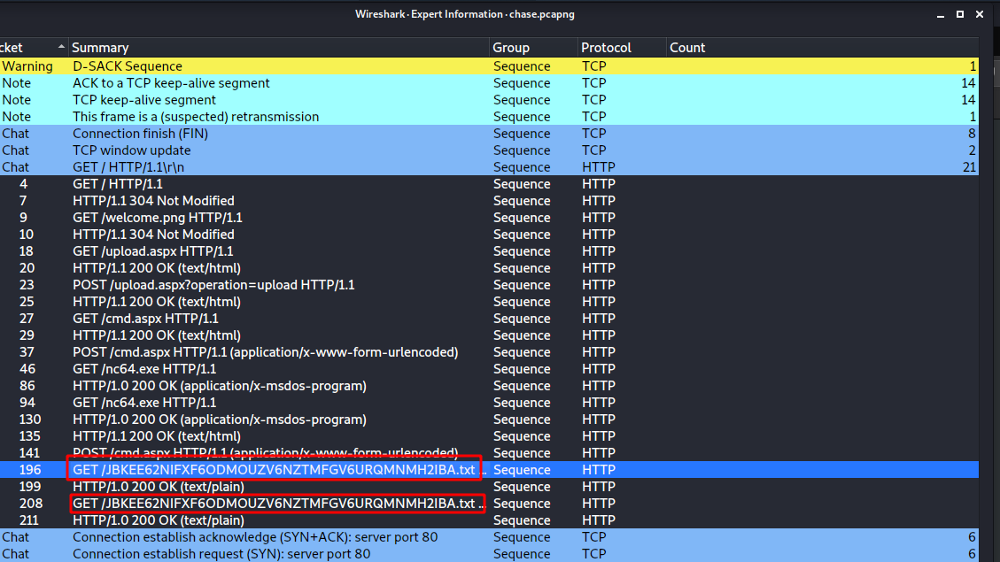

# Chase

Completed: Yes
Date: July 2, 2021 → July 2, 2021
Platform: HackTheBox

Open pcap file in Wireshark. If you will trace the HTTP protocol, you will see that the attacker went to `/upload.aspx`. Then he uploaded `cmd.exe`. After that, he uploaded netcat.exe with certutil. He used Netcat to get a reverse shell. BUT. Some traffic will not be shown to you directly. I didn't found them too. BUT with Wireshark `Expert information` I found them.

This is the flag in base32.
