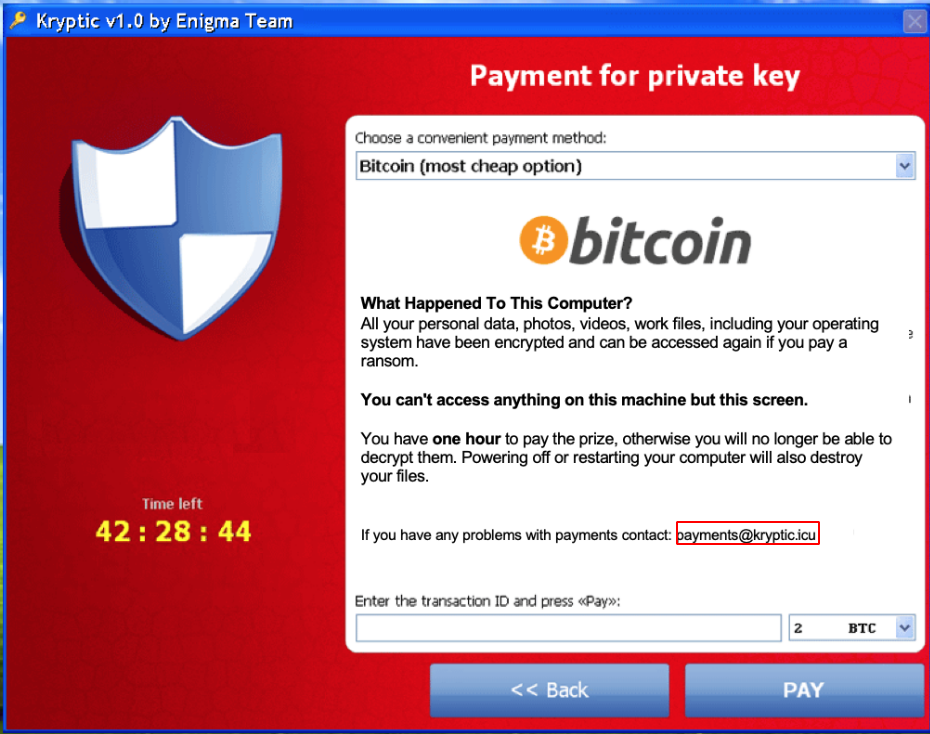

# Kryptic Ransomware

Completed: Yes
Platform: HackTheBox



On the image, we see an email with a domain. Tried to check it with WHOIS, but the domain is over now. So, I used WHOIS history ([https://lookup.icann.org/lookup](https://lookup.icann.org/lookup)) to check if there is some info that remains about this domain `kryptic.icu`.  Thus, I found:

- Name: mr en1gm4
- Email: mr_en1gm4@kryptic.icu

His Twitter is [https://twitter.com/mr_en1gm4?lang=en](https://twitter.com/mr_en1gm4?lang=en). Also, his protonmail: [https://website.informer.com/email/mr_en1gm4@protonmail.com](https://website.informer.com/email/mr_en1gm4@protonmail.com).

This tweet([https://twitter.com/AkiRoots/status/1111460741968617472](https://twitter.com/AkiRoots/status/1111460741968617472)) is pretty useful for us because it leads us to flickr.com. Here, we can find our user mr_enigma: [https://www.flickr.com/photos/164925319@N02](https://www.flickr.com/photos/164925319@N02).

After some time, I finally found needed coordinates:

```bash
exiftool ~/Downloads/46576284795_40d714a016_o.jpg 
ExifTool Version Number         : 12.30
File Name                       : 46576284795_40d714a016_o.jpg
Directory                       : /root/Downloads
File Size                       : 63 KiB
File Modification Date/Time     : 2021:09:17 14:44:54-04:00
File Access Date/Time           : 2021:09:17 14:44:54-04:00
File Inode Change Date/Time     : 2021:09:17 14:44:56-04:00
File Permissions                : -rw-r--r--
File Type                       : JPEG
File Type Extension             : jpg
MIME Type                       : image/jpeg
JFIF Version                    : 1.01
Exif Byte Order                 : Big-endian (Motorola, MM)
Document Name                   : IMG_20190315_042493.jpg
Image Description               : localhost
X Resolution                    : 72
Y Resolution                    : 72
Resolution Unit                 : inches
Y Cb Cr Positioning             : Centered
GPS Version ID                  : 2.3.0.0
GPS Latitude Ref                : North
GPS Longitude Ref               : East
Image Width                     : 800
Image Height                    : 600
Encoding Process                : Baseline DCT, Huffman coding
Bits Per Sample                 : 8
Color Components                : 3
Y Cb Cr Sub Sampling            : YCbCr4:2:0 (2 2)
Image Size                      : 800x600
Megapixels                      : 0.480
GPS Latitude                    : 34 deg 58' 48.30" N
GPS Longitude                   : 32 deg 58' 34.84" E
GPS Position                    : 34 deg 58' 48.30" N, 32 deg 58' 34.84" E
```

Now, we just need to translate GPS coordinates from degrees minutes seconds to decimal degree and submit it to the given app. 

Converter: [https://www.fcc.gov/media/radio/dms-decimal](https://www.fcc.gov/media/radio/dms-decimal).
