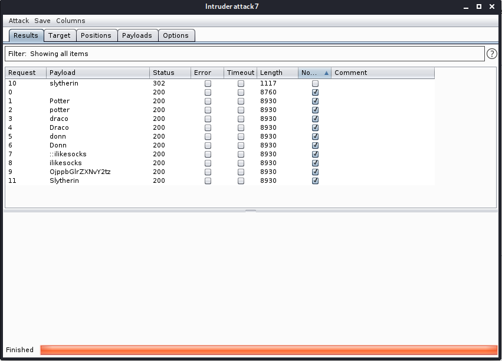

# Hogwarts: Dobby

[Machine](https://www.vulnhub.com/entry/hogwarts-dobby,597/ "https://www.vulnhub.com/entry/hogwarts-dobby,597/")

## Reconnaissance 

### nmap

* http

#### http

Start page with `<title>Draco:dG9vIGVhc3kgbm8/IFBvdHRlcg==</title>`. `echo dG9vIGVhc3kgbm8/IFBvdHRlcg== | base64 -d` will show that the encoded string is `Potter`. I dunno what it is. (`whatweb` also shows you the full title of page)
```
dirb http://192.168.0.107/ /usr/share/wordlists/dirb/big.txt -o dirb.txt
```
This will reveal `/log` path. In which:
```
pass:OjppbGlrZXNvY2tz

hint --> /DiagonAlley
```
Go to `/DiagonAlley` and you'll see the true site. `dirb` and `whatweb` detect the WordPress. On the site, you'll find the post with brainfuck...Just send it to the decoder. But it doesn't matter.

Okay, I found the `/wp-admin` path and tried all the found strings, but password `slytherin` was obvious.



## Thread modeling

So, we have the WordPress and creds to the admin panel...There are so many ways to exploit WordPress. I described a few in ["KB-VULN: 2"](https://github.com/whatsyourask/ctf-writeups/blob/hogwarts/VulnHub/KB-VULN:%202/README.md "https://github.com/whatsyourask/ctf-writeups/blob/hogwarts/VulnHub/KB-VULN:%202/README.md").

## Vulnerability analysis

I tried to modify a theme and it works. So, I will just edit the script `404.php` to php-reverse-shell.
Also, I will try to exploit WordPress in other ways.

## Exploitation

### 404.php

Just erase all and paste [php-reverse-shell](http://pentestmonkey.net/tools/web-shells/php-reverse-shell "http://pentestmonkey.net/tools/web-shells/php-reverse-shell"). It works. Don't forget to change the ip-address and port within the script. Shell as `www-data`.

### Plugin editor

It is the second time when I used this method. Edit plugin `akismet/class.akismet-admin.php`. I just added a simple `exec();` function to the beginning. Activate the plugin and wait for shell.

### Add plugin

Doesn't work with a simple shell.php file.

### Add media

Same as previous.

## Post exploitation

Now, we can switch user, because `pass:OjppbGlrZXNvY2tz` is `::ilikesocks` and it is a password for `dobby`. `find / -perm -4000 -type f 2>/dev/null` will show you a nice list of SUID binaries. But interesting is two - base32 and find.

base32 is contained in GTFObins. You can read the arbitrary file with `LFILE=/etc/shadow && base32 "$LFILE" | base32 --decode`, but I didn't find some way to exploit it, `/etc/shadow` didn't reveal the root hash. But find is more interesting than base32. It is also in GTFObins. `find . -exec /bin/sh -p \; -quit` will give a root shell.

I also found a dobby `lxd` group, but there is no `lxc` binary.

