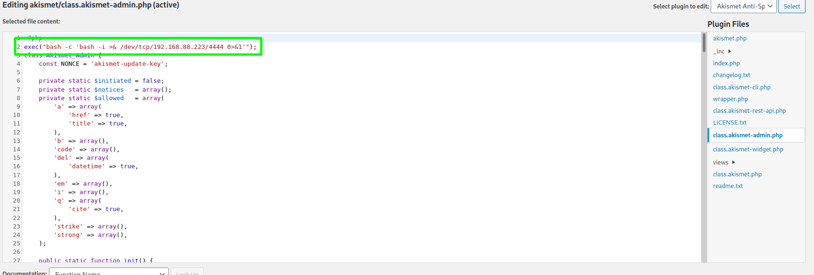

# KB-VULN: 2

[Machine](https://www.vulnhub.com/entry/kb-vuln-2,562/ "https://www.vulnhub.com/entry/kb-vuln-2,562/")

## Reconnaissance 

### nmap

* ftp
* ssh
* http
* smb

### ftp

Anonymous user is not allowed.

### http

The start page is an Apache start page. But after `dirb` scan you can get a new URL `wordpress/`. Also, you need to add to your /etc/hosts the target as 'kb.vuln'. 
I did a lot of enumeration on WordPress and its version doesn't have critical vulnerabilities.

You can get a version of wordpress with `whatweb http://kb.vuln/wordpress/` or with this command from the hacktricks.xyz:
```
curl -s -X GET https://wordpress.org/support/article/pages/ | grep http | grep -E '?ver=' | sed -E 's,href=|src=,THIIIIS,g' | awk -F "THIIIIS" '{print $2}' | cut -d "'" -f2
```

### smb

```
smbclient -N -L \\\\192.168.88.222\\
```

```
smbclient \\\\192.168.88.222\\Anonymous -U anonymous
```

Samba has anonymous user access. And you will get the backup.zip file. File `remember_me.txt` with credentials.

## Thread modeling

So we have the credentials and `/wordpress/wp-admin/`. Next, you need to try to exploit WordPress. I found out a few ways to exploit WordPress:

* use current installed plugins.
* install your PHP code as a new plugin.
* themes.
* file via Media.
* add a malicious plugin and use it.

## Vulnerability analysis

1. I tried the method with the adding PHP reverse shell to the file 404.php in themes. But it will not work because you can't save this file. So I think that themes are not the main thread.
2. File via Media is not work too, because there is a validation of file format. And putting the PHP code inside the image didn't work for me.
3. Install a new plugin with PHP reverse shell didn't work either, because again there is a validation of file format and its content.
4. The case with a malicious plugin didn't work.
5. Using an installed plugins works! 

## Exploitation

I choose an akismet plugin. Just write your reverse shell:



Then activate the plugin and you will receive the shell. But it'll be www-data user...

## Post exploitation

While I was as www-data, I tried many things... And I figured out there was a `kbadmin` user. But then I realized, maybe the password is repeated. YES. All services accepted this password.
Easy ssh, easy FTP (with wordpress content).
In the home directory, you can see the note about docker. Also you can enumerate /opt/containerd, process, socket, ifconfig...

SO, the next thing you need to do is execute `id` and see if you are in a docker group. 999(docker)!
You can search about privilege escalation with the docker group and understand how it's easy.
```
docker run -v /:/mnt -it alpine chroot /mnt bash
```
-v - bind mount a volume which I specified next.
-it - shell mode. 
chroot - change apparent root directory and execute bash (because command=bash, in this case).

Got root.

## Sources

[hacktricks](https://book.hacktricks.xyz/ "https://book.hacktricks.xyz/")

[docker PE](https://www.hackingarticles.in/docker-privilege-escalation/ "https://www.hackingarticles.in/docker-privilege-escalation/")
