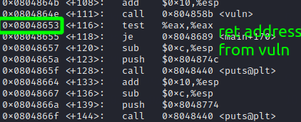
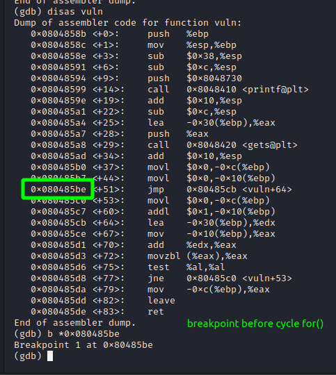
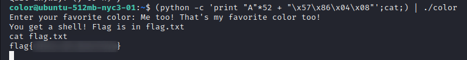

./checksec.sh:

I've spent a lot of time trying to use it with the shellcode in Buff. But then I realized that there is a simple solution.
Source code:

if good> 0, then we get a shell. But this is not possible with `int good = 0;`. And this is what I was spending all my time on trying to change the value using shellcode.
LOL.
On the stack, just rewrite the return address.

Look at the address after vuln call:

Set a breakpoint and look at the stack:

Overflow the buffer:

Choose a new return address. I just skip if(vuln) and execute the body of it:

