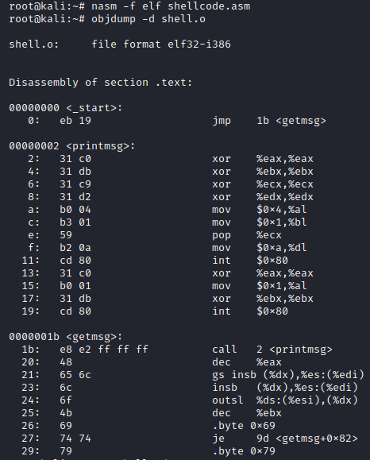

#Shellcoding

Firstly, we write a program that will give us a shell.

[c-program](shell.c)

Now, we need to do copy of that behavior on assembly.
We have to get string "/bin/sh" but how?
Explanation in the code below:

[shell](shell.asm)

~~~
Remember that shellcode must not have a zeros.It will terminate the input string.
~~~

We can translate assembly to machine code and get the shellcode:
`nasm -f elf shell.asm`
`objdump -d shell.o`
or just use the commands chain from google [script](get_the_shellcode.sh)

Check if it works:

Shellcode is ready!
