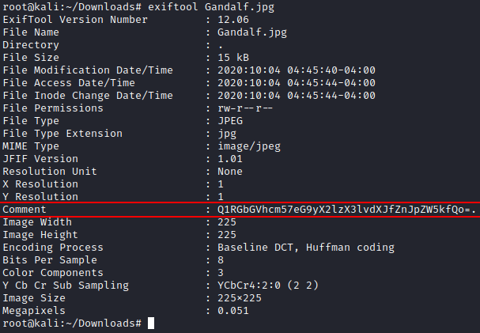

Base64 encoded comment gives a hint.XOR. But what?

I did again `strings -n 16` and got a 3 encoded strings. First of them was above.

So we need to decode 2 remaining strings and xor them. I wrote a script as stated in the challenge.

[script](get_flag.py)
