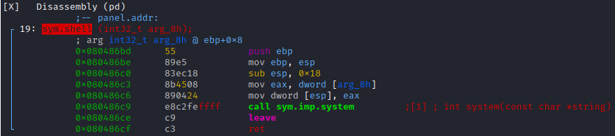
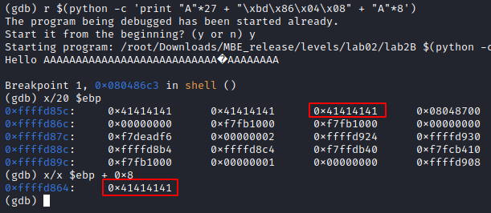

# Solution of lab2B

Just like in lab02C i did the buffer overflow and got the segmentation fault:

To see if there is a shell function I used `radare2 lab2B` and went through the disassembly, you also can use `objdump -d lab2B`.

I tried to jump to shell function from return address but it didn't work:

Then you need to pay attention and go through the shell disassembly. There is no defined string with "/bin/sh". Again i looked at radare analysys and found the string "/bin/sh":

Now, we need to push onto the stack our string "/bin/sh". I set a breakpoint where i can look at the stack.

Here we see a piece of our As line. I'm going to `0x080486bd` because the old ebp needs to be pushed onto the stack to define `ebp + 0x8`. Then I thought that if I push onto the stack as a line after the address we are jumping to, maybe I can set ebp + 0x8 to the '/ bin / sh' line address.

I set ebp + 0x8 to 0x41414141:

Add 0x080487d0:

