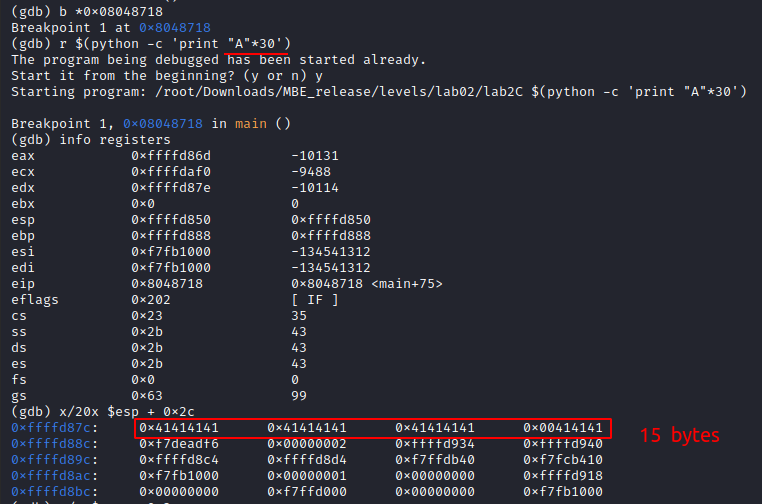

Try to type a lot of As and get segmentation fault to check if there is a buffer overflow:

Check different length of As in `gdb`:

And here we go. I found that the As offset is 31 and the next 4 bytes are good enough to return to the correct address.

Next, I disassembly the main function and found next part:

Now, we have 2 options. First - just overflow the buffer and set return address to shell function call(instead of Bs write the correct address). Second - just complete the condition [esp + 0x2c] == 0xdeadbeef.

Our As offset is 15 bytes because in 20 bytes on esp + 0x2c we can only see 15 bytes out of 30 bytes.

