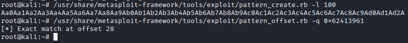
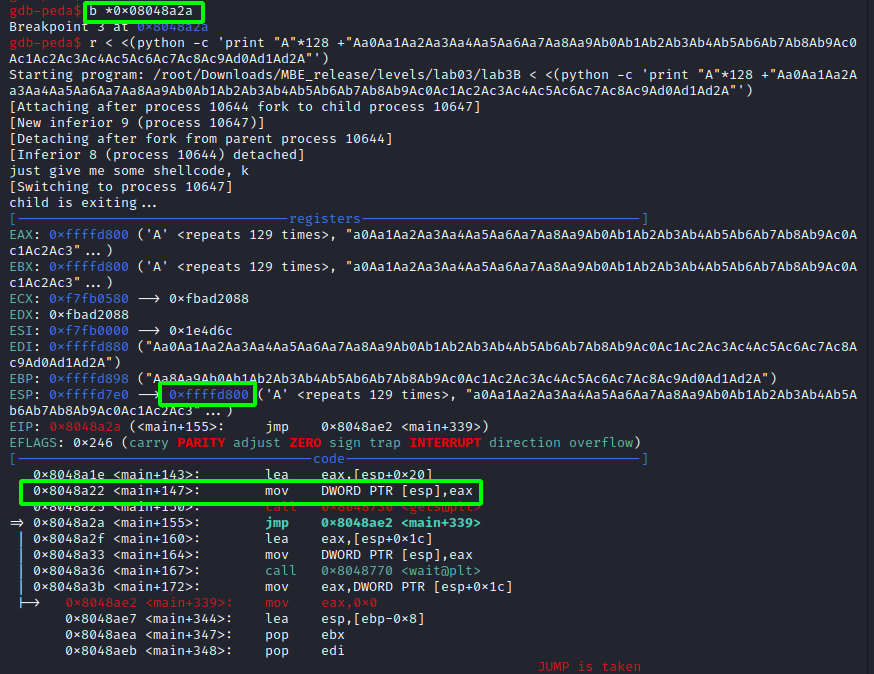
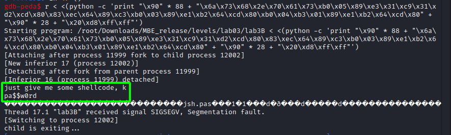

# Solution of lab3B

Now, as the program says, we need to add the shellcode. At first I tried, but then I immediately realized that there is no overflow protection.

Here we go. The offset is 28 bytes. Now determine the address of buffer:

From here we can start to write the shellcode. We need a 3 syscalls: open(), read(), write(). Also we need to hex encode the filename with `python -c 'print "some_file_name".encode("hex")'`. [Here the shellcode with comments.](shellcode.asm)

Then check the shellcode:

We can read the ".pass" file. I am doing everything on a local kali linux machine, so I just created one and read this file from the lab3B binary. Yes, it's the same, but we need to make sure it works with lab3B.

To extract the shellcode i used the old [script](https://github.com/whatsyourask/CTFlearn-writeups/blob/main/binary/Shell%20time!/shellcode/get_the_shellcode.sh) from another repository.

[Possible exploit](exploit.py)
