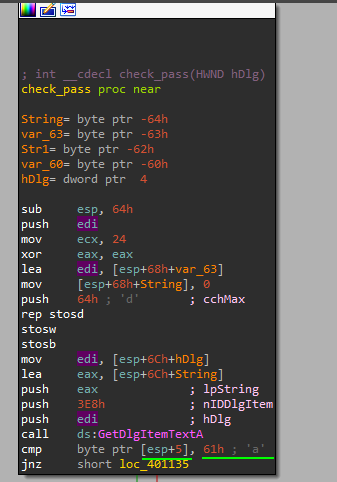

# Easy Crack

Platform: Reversing.Kr

In the beginning, the program receives the text from the textbox. Then it compares the second character with `a` char. If they're equal it goes further.

After the first check, the program moves on 2 chars and compares substring `5` with the next 2 chars after 2 started chars.

Then, it compares the substring `R3versing` with the remained part of our string.

if it's okay, then the program moves on and performs the last check - check if the first character is equal to `E`.

Thus, the final password is `Ea5yR3versing`.
