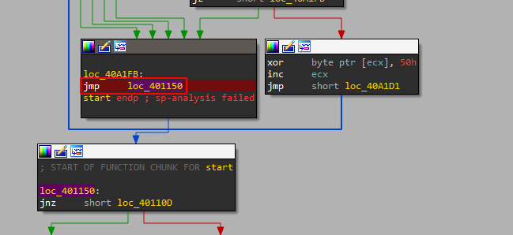

# Easy Unpack

Platform: Reversing.Kr

Open the file in IDA. We have only one function `start` with the process of unpacking the real code. If you inspect deeper, you will find the place where we jump to some address:

Do debug and then go to this address:

The actual code is here. So, the OEP or Original Entry Pointer is `0x401150`.
